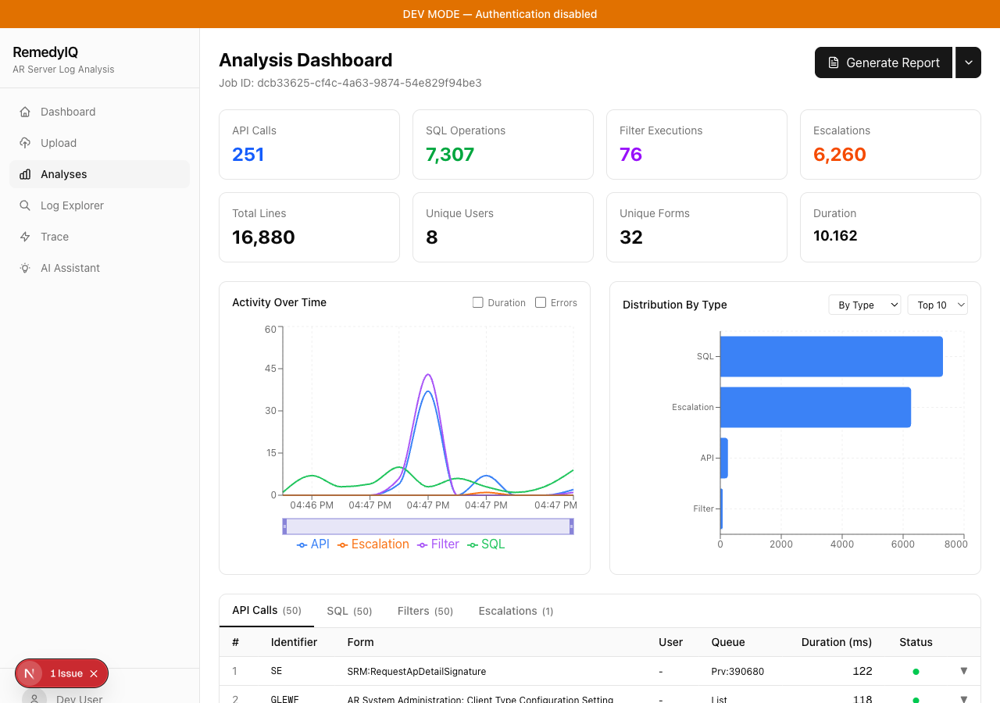
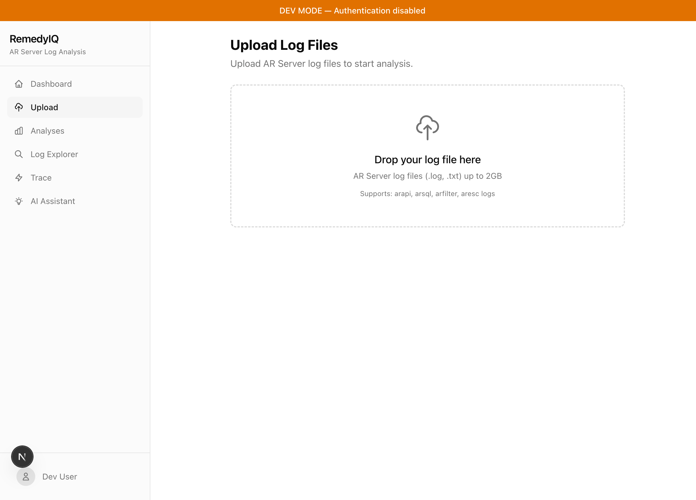
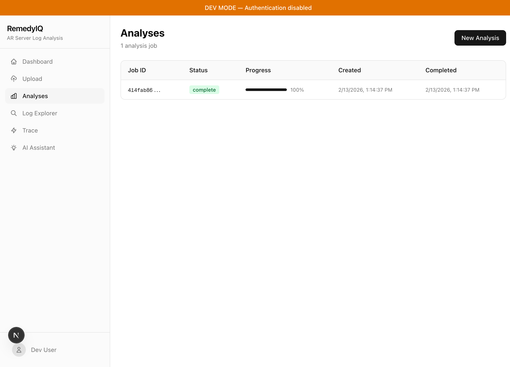
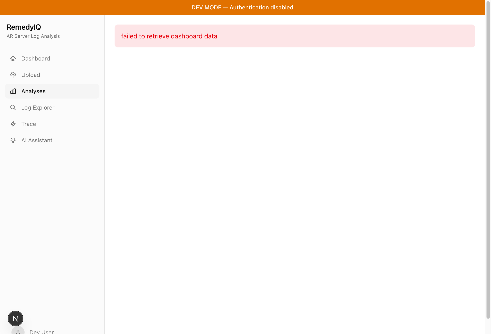
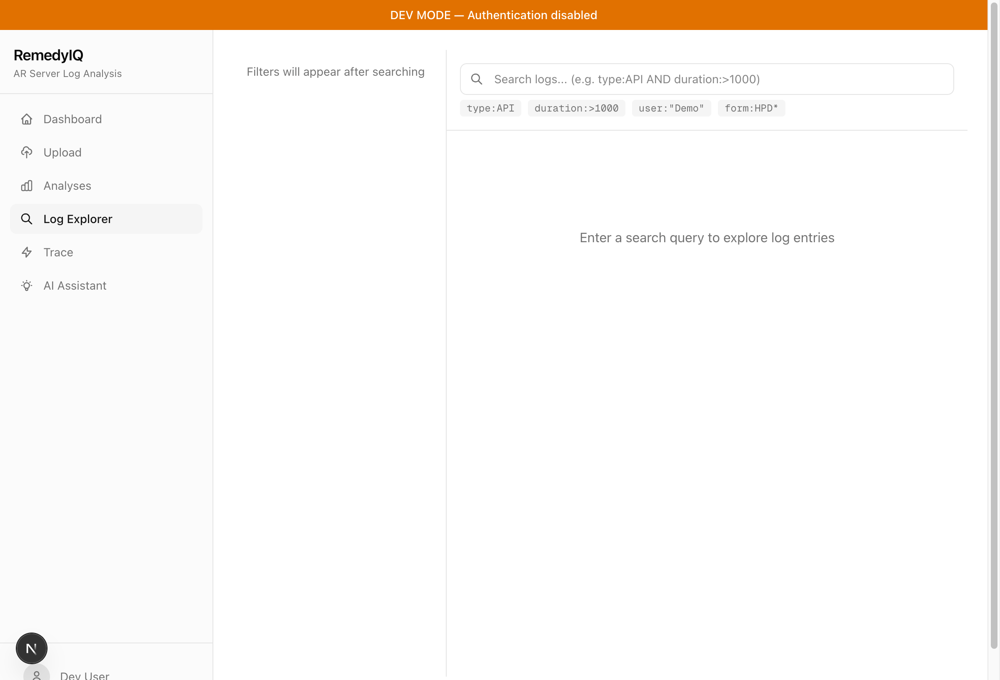
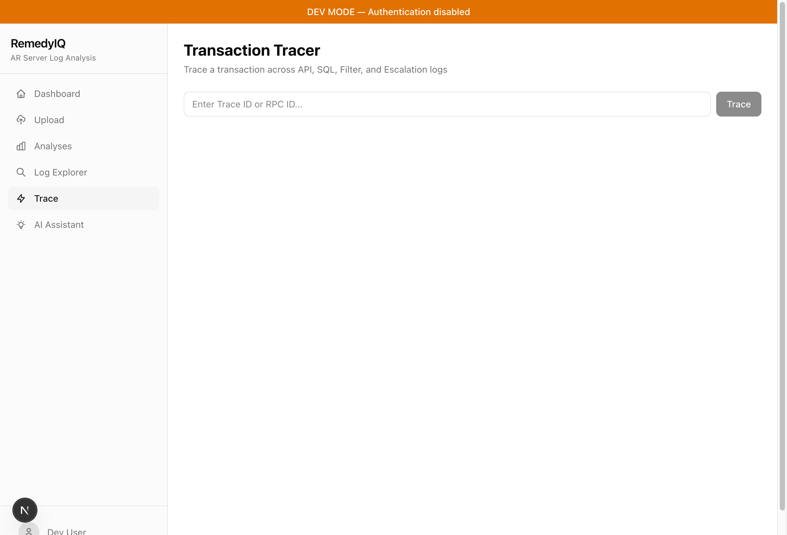
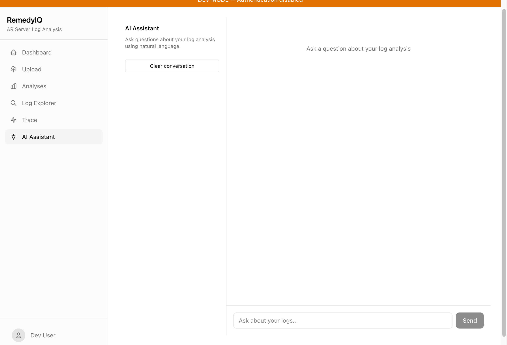

<div align="center">

# RemedyIQ

**Enterprise Log Intelligence for BMC Remedy AR Server**

Turn millions of AR Server log lines into actionable insights in seconds.

[](https://golang.org/)
[](https://nextjs.org/)
[](https://clickhouse.com/)
[](LICENSE)

[Getting Started](#getting-started) &bull; [Features](#features) &bull; [Screenshots](#screenshots) &bull; [Architecture](#architecture) &bull; [API Reference](#api-reference) &bull; [Contributing](#contributing)

---



</div>

## Why RemedyIQ?

BMC Remedy AR Server generates massive log files across four categories &mdash; API, SQL, Filter, and Escalation &mdash; that are difficult to analyze with traditional tools. RemedyIQ ingests these logs, indexes every entry in ClickHouse, and gives your team a modern web interface to search, visualize, and understand what happened.

- **Upload once, explore endlessly.** Drag-and-drop a log file, wait for parsing, then search across millions of entries with KQL syntax.
- **See the big picture.** A 10-section dashboard surfaces health scores, performance aggregates, exception reports, gap analysis, thread utilization, and filter complexity.
- **Drill into the details.** The Log Explorer lets you filter by time range, sort by any column, view surrounding context, trace correlated entries, and export results.
- **Get AI-powered answers.** Ask natural language questions and receive structured analysis backed by log evidence.

---

## Getting Started

### Prerequisites

| Dependency | Version |
|-----------|---------|
| Go | 1.24+ |
| Node.js | 20+ |
| Docker & Docker Compose | Latest |

### Setup

```bash
# Clone
git clone https://github.com/OmarEhab007/RemedyIQ.git
cd RemedyIQ

# Start infrastructure (PostgreSQL, ClickHouse, NATS, Redis, MinIO)
make docker-up

# Initialize databases
make db-setup

# Install dependencies
make deps

# Start backend (API + Worker)
make dev

# In a second terminal, start the frontend
cd frontend && npm install && npm run dev
```

Open **http://localhost:3000** in your browser.

### Service URLs

| Service | URL |
|---------|-----|
| Frontend | http://localhost:3000 |
| API | http://localhost:8080/api/v1 |
| NATS Monitor | http://localhost:8222 |
| MinIO Console | http://localhost:9001 |

---

## Features

### Log Upload & Parsing

Upload AR Server log files through a drag-and-drop interface. RemedyIQ detects the log type automatically, parses entries using the ARLogAnalyzer engine, and stores structured results in ClickHouse. Progress streams to the browser over WebSocket.

### Analysis Dashboard

A comprehensive dashboard with ten sections, each lazy-loaded for performance:

| Section | What It Shows |
|---------|--------------|
| **Health Score** | Composite 0&ndash;100 score factoring error rate, response time, thread saturation, and gap frequency |
| **Statistics** | Entry counts by type, unique users/forms/tables/queues, log time span |
| **Top-N Operations** | Slowest API calls, SQL queries, filter executions, and escalations with expandable detail rows |
| **Time Series** | Volume over time with toggleable duration and error overlays, click-and-drag zoom |
| **Distribution** | Donut chart by log type, horizontal bar charts by queue/form/user/table with configurable top-N |
| **Aggregates** | Tabbed tables (API by Form, API by User, SQL by Table) with sortable columns and grand totals |
| **Exceptions** | Error codes grouped with occurrence counts, per-log-type error rates, and sample context |
| **Gap Analysis** | Line gaps and thread gaps ranked by duration with critical gap highlighting |
| **Threads** | Per-thread utilization, busy percentage, and warning indicators |
| **Filters** | Most-executed filters and per-transaction filter metrics |

### Log Explorer

A full-featured search interface for individual log entries:

- **KQL Search** &mdash; Boolean operators (`AND`, `OR`, `NOT`), field-value pairs, ranges, wildcards, quoted strings
- **Time Range Picker** &mdash; Relative presets (15m, 1h, 24h, 7d) and absolute date selection
- **Timeline Histogram** &mdash; Visual log volume over time, color-coded by type, with click-to-zoom
- **Faceted Filters** &mdash; Sidebar filters by log type, user, queue, form, and status
- **Column Sorting** &mdash; Click headers to sort by timestamp, duration, type, or user
- **Detail Panel** &mdash; Full entry view with related entries navigation via trace/RPC IDs
- **Context View** &mdash; Show surrounding log lines for any selected entry
- **Saved Searches** &mdash; Save and reload named queries
- **Export** &mdash; Download results as CSV or JSON
- **Keyboard Shortcuts** &mdash; `/` to focus search, arrow keys to navigate, `Esc` to close panels

### AI Insights

Ask questions in plain English. RemedyIQ uses Claude to analyze log patterns and returns structured answers with line-number references, confidence scores, and suggested follow-up questions.

### Transaction Tracing

Visualize the complete lifecycle of a request across API, Filter, SQL, and Escalation logs. Supports AR 19.x+ trace IDs with RPC ID fallback for earlier versions.

### Report Generation

Generate HTML and JSON analysis reports on demand, cached in Redis for fast subsequent downloads.

---

## Screenshots

<details>
<summary><strong>Upload</strong></summary>
<br />

</details>

<details>
<summary><strong>Analyses List</strong></summary>
<br />

</details>

<details>
<summary><strong>Dashboard</strong></summary>
<br />

</details>

<details>
<summary><strong>Analysis Detail</strong></summary>
<br />

</details>

<details>
<summary><strong>Log Explorer</strong></summary>
<br />

</details>

<details>
<summary><strong>Trace Viewer</strong></summary>
<br />

</details>

<details>
<summary><strong>AI Insights</strong></summary>
<br />

</details>

---

## Architecture

```
┌──────────────────────────────────────────────────────────────┐
│                     Frontend (Next.js 16)                     │
│   Dashboard  ·  Explorer  ·  Upload  ·  Trace  ·  AI Chat    │
└──────────────────────────┬───────────────────────────────────┘
                           │ REST + WebSocket
┌──────────────────────────┴───────────────────────────────────┐
│                      API Server (Go)                          │
│   gorilla/mux  ·  Auth Middleware  ·  Handlers  ·  Streaming  │
└───────┬──────────────┬──────────────┬────────────────────────┘
        │              │              │
   ┌────┴────┐   ┌─────┴─────┐  ┌────┴────┐
   │ Worker  │   │   NATS    │  │  Bleve  │
   │  (Go)   │◄──┤ JetStream │  │ Search  │
   └────┬────┘   └───────────┘  └─────────┘
        │
┌───────┴──────────────────────────────────────────────────────┐
│                        Storage Layer                          │
│  ┌────────────┐ ┌────────────┐ ┌─────────┐ ┌──────────────┐ │
│  │ ClickHouse │ │ PostgreSQL │ │  Redis  │ │  MinIO / S3  │ │
│  │  Log Data  │ │  Metadata  │ │  Cache  │ │  Raw Files   │ │
│  │  + MVs     │ │  + RLS     │ │  5min   │ │              │ │
│  └────────────┘ └────────────┘ └─────────┘ └──────────────┘ │
└──────────────────────────────────────────────────────────────┘
```

**Three services, clear boundaries:**

1. **API Server** &mdash; Serves REST endpoints and WebSocket connections. Stateless, horizontally scalable.
2. **Worker** &mdash; Consumes NATS jobs for parsing, indexing, and AI analysis. Runs ARLogAnalyzer.jar as a subprocess.
3. **Frontend** &mdash; Next.js with server-side rendering, shadcn/ui components, and Recharts visualizations.

**Storage by purpose:**

| Store | Role |
|-------|------|
| ClickHouse | Log entries, materialized views for aggregates, time-series queries |
| PostgreSQL | Job metadata, tenant management, saved searches, RLS-based isolation |
| Redis | Response caching (5-min TTL), autocomplete, query history |
| MinIO / S3 | Raw uploaded log files |

---

## Technology Stack

### Backend

| | Technology | Purpose |
|-|-----------|---------|
| | Go 1.24 | API server, worker, business logic |
| | gorilla/mux | HTTP routing and middleware |
| | pgx/v5 | PostgreSQL driver with connection pooling |
| | clickhouse-go/v2 | ClickHouse native protocol driver |
| | go-redis/v9 | Redis client |
| | nats.go | NATS JetStream messaging |
| | bleve/v2 | Full-text search indexing |
| | Anthropic SDK | Claude AI integration |

### Frontend

| | Technology | Purpose |
|-|-----------|---------|
| | Next.js 16 + React 19 | App Router, SSR, streaming |
| | TypeScript 5 | Type safety |
| | shadcn/ui + Radix | Accessible UI primitives |
| | Tailwind CSS 4 | Utility-first styling |
| | Recharts | Charts and visualizations |
| | react-window | Virtual scrolling for large datasets |

---

## API Reference

### Core Endpoints

| Method | Path | Description |
|--------|------|-------------|
| `POST` | `/api/v1/logs/upload` | Upload a log file |
| `GET` | `/api/v1/jobs` | List analysis jobs |
| `GET` | `/api/v1/jobs/:id` | Get job status |
| `GET` | `/api/v1/analysis/:id/dashboard` | Dashboard statistics and health score |
| `GET` | `/api/v1/analysis/:id/aggregates` | Performance aggregates by form, user, table |
| `GET` | `/api/v1/analysis/:id/exceptions` | Exception reports by error code |
| `GET` | `/api/v1/analysis/:id/gaps` | Gap analysis (line gaps, thread gaps) |
| `GET` | `/api/v1/analysis/:id/threads` | Thread statistics and utilization |
| `GET` | `/api/v1/analysis/:id/filters` | Filter complexity metrics |
| `GET` | `/api/v1/analysis/:id/search` | Search log entries (KQL) |
| `GET` | `/api/v1/analysis/:id/search/export` | Export search results (CSV/JSON) |
| `GET` | `/api/v1/analysis/:id/entries/:entry_id` | Fetch a single log entry |
| `GET` | `/api/v1/analysis/:id/entries/:entry_id/context` | Surrounding log context |
| `GET` | `/api/v1/search/autocomplete` | Field/value suggestions |
| `GET` | `/api/v1/trace/:id` | Transaction trace |
| `POST` | `/api/v1/ai/query` | AI-powered natural language query |
| `GET` | `/api/v1/report/:id` | Generate analysis report |
| `GET` | `/api/v1/health` | Health check |

### Search Syntax

```
# Boolean operators
type:API AND duration:>1000
user:admin OR user:system
NOT status:error

# Field queries
form:"HPD:Help Desk" queue:admin*
trace_id:abc123

# Ranges
duration:>500 timestamp:>2024-01-01T00:00:00Z

# Wildcards
form:HPD:* user:admin*
```

### Example Requests

```bash
# Upload a log file
curl -X POST http://localhost:8080/api/v1/logs/upload \
  -H "Authorization: Bearer <token>" \
  -F "file=@arapi.log" -F "log_type=api"

# Search for slow API calls
curl "http://localhost:8080/api/v1/analysis/JOB_ID/search?q=type:API+AND+duration:>1000&limit=50" \
  -H "Authorization: Bearer <token>"

# Ask AI a question
curl -X POST http://localhost:8080/api/v1/ai/query \
  -H "Authorization: Bearer <token>" \
  -H "Content-Type: application/json" \
  -d '{"query": "What caused the spike in errors at 3pm?"}'
```

---

## Project Structure

```
RemedyIQ/
├── backend/
│   ├── cmd/api/              # API server entrypoint
│   ├── cmd/worker/           # Worker entrypoint
│   ├── internal/
│   │   ├── ai/               # AI skill orchestration
│   │   ├── api/              # HTTP handlers, middleware, router
│   │   ├── config/           # Configuration
│   │   ├── domain/           # Domain models
│   │   ├── jar/              # ARLogAnalyzer.jar wrapper
│   │   ├── logparser/        # Native Go log parsers
│   │   ├── search/           # KQL parser, Bleve engine
│   │   ├── storage/          # ClickHouse + PostgreSQL repositories
│   │   ├── streaming/        # WebSocket handlers
│   │   └── worker/           # Job processing pipeline
│   ├── migrations/           # Database migrations
│   └── testdata/             # Test fixtures
├── frontend/
│   └── src/
│       ├── app/              # Next.js App Router pages
│       ├── components/       # React components (dashboard, explorer, UI)
│       ├── hooks/            # Custom hooks (search, WebSocket)
│       └── lib/              # API client, utilities, KQL tokenizer
├── ARLogAnalyzer/            # BMC JAR distributions
├── docs/                     # Documentation and screenshots
├── specs/                    # Feature specifications
└── docker-compose.yml        # Local infrastructure
```

---

## Development

### Running Tests

```bash
# Backend (with race detection and coverage)
cd backend && go test -race -coverprofile=coverage.out ./...

# Frontend
cd frontend && npm test

# Lint
cd frontend && npm run lint
cd backend && go vet ./...
```

### Environment Variables

| Variable | Description | Default |
|----------|-------------|---------|
| `POSTGRES_HOST` | PostgreSQL host | `localhost` |
| `POSTGRES_PORT` | PostgreSQL port | `5432` |
| `CLICKHOUSE_HOST` | ClickHouse host | `localhost` |
| `CLICKHOUSE_PORT` | ClickHouse native port | `9000` |
| `REDIS_HOST` | Redis host | `localhost` |
| `NATS_URL` | NATS connection URL | `nats://localhost:4222` |
| `S3_ENDPOINT` | MinIO/S3 endpoint | `http://localhost:9002` |
| `CLAUDE_API_KEY` | Anthropic API key for AI features | &mdash; |
| `CLERK_SECRET_KEY` | Clerk authentication secret | &mdash; |

---

## Roadmap

- [x] Log upload, parsing, and ingestion pipeline
- [x] ClickHouse storage with materialized views
- [x] Multi-tenant isolation (PostgreSQL RLS)
- [x] 10-section analysis dashboard
- [x] KQL search with Bleve full-text indexing
- [x] Complete Log Explorer (time range, histogram, sorting, export, saved searches)
- [x] AI-powered natural language queries
- [x] Transaction tracing (trace ID + RPC ID)
- [x] Report generation (HTML + JSON)
- [ ] Anomaly detection baselines and alerts
- [ ] Scheduled reports and notifications
- [ ] ITSM integrations (ServiceNow, Jira, PagerDuty)
- [ ] Kubernetes deployment with Helm charts
- [ ] Comparative analysis across time periods

---

## Contributing

1. Fork the repository
2. Create a feature branch (`git checkout -b feature/my-feature`)
3. Run tests (`make test`)
4. Open a Pull Request

See [AGENTS.md](AGENTS.md) for coding standards and conventions.

---

## License

[MIT](LICENSE)

---

## Acknowledgments

- [BMC Remedy](https://www.bmc.com/it-solutions/remedy-itsm.html) &mdash; The AR Server platform whose logs we analyze
- [ARLogAnalyzer](https://github.com/nicholasng1998/ARLogAnalyzer) &mdash; The original CLI tool that inspired this project
- [Anthropic Claude](https://www.anthropic.com/) &mdash; AI-powered analysis engine
- [Clerk](https://clerk.com/) &mdash; Authentication and multi-tenant management

---

<div align="center">

Built for BMC Remedy administrators who need answers, not more log files.

</div>
