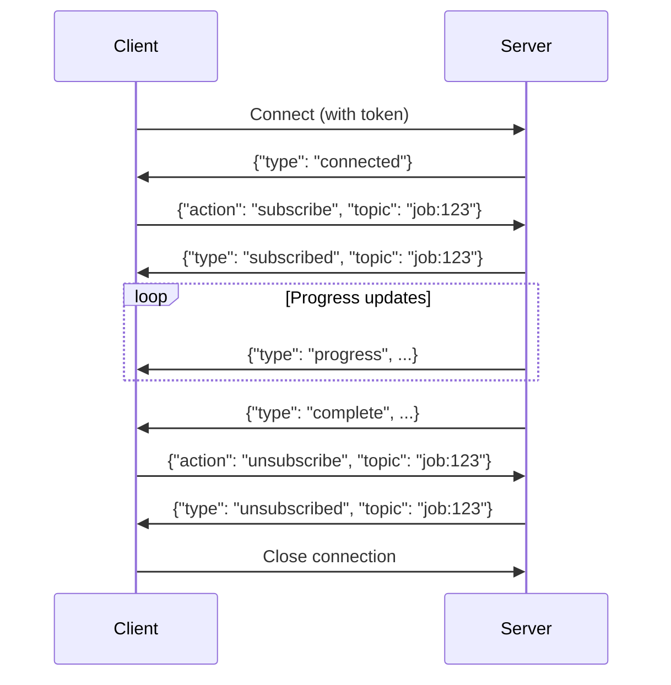

# WebSocket Protocol

This document describes the WebSocket protocol for real-time updates.

## Connection

### Endpoint

```
wss://api.example.com/api/v1/ws
```

### Authentication

Include the JWT token as a query parameter or in the first message:

```
wss://api.example.com/api/v1/ws?token=<jwt_token>
```

Or send after connection:
```json
{"action": "auth", "token": "<jwt_token>"}
```

## Message Format

All messages are JSON.

### Client → Server

#### Subscribe to Job Updates

```json
{
  "action": "subscribe",
  "topic": "job:550e8400-e29b-41d4-a716-446655440000"
}
```

#### Unsubscribe

```json
{
  "action": "unsubscribe",
  "topic": "job:550e8400-e29b-41d4-a716-446655440000"
}
```

#### Ping

```json
{
  "action": "ping"
}
```

### Server → Client

#### Progress Update

```json
{
  "type": "progress",
  "job_id": "550e8400-e29b-41d4-a716-446655440000",
  "pct": 45,
  "status": "parsing",
  "message": "Processed 45,000 lines"
}
```

#### Job Complete

```json
{
  "type": "complete",
  "job_id": "550e8400-e29b-41d4-a716-446655440000",
  "api_count": 1500,
  "sql_count": 3000,
  "filter_count": 5000,
  "esc_count": 200
}
```

#### Job Failed

```json
{
  "type": "error",
  "job_id": "550e8400-e29b-41d4-a716-446655440000",
  "message": "JAR execution failed: out of memory"
}
```

#### Pong

```json
{
  "type": "pong"
}
```

#### Error

```json
{
  "type": "error",
  "code": "invalid_topic",
  "message": "Invalid topic format"
}
```

## Message Types

### Progress Message

| Field | Type | Description |
|-------|------|-------------|
| type | string | Always "progress" |
| job_id | string | Job UUID |
| pct | int | Progress percentage (0-100) |
| status | string | Current status |
| message | string | Human-readable status |

**Status Values:**
- `queued` - Waiting for worker
- `parsing` - Executing JAR
- `analyzing` - Parsing output
- `storing` - Writing to ClickHouse
- `complete` - Finished
- `failed` - Error occurred

### Complete Message

| Field | Type | Description |
|-------|------|-------------|
| type | string | Always "complete" |
| job_id | string | Job UUID |
| api_count | int | Number of API entries |
| sql_count | int | Number of SQL entries |
| filter_count | int | Number of filter entries |
| esc_count | int | Number of escalation entries |

## Connection Lifecycle



## Error Codes

| Code | Description |
|------|-------------|
| `unauthorized` | Missing or invalid token |
| `invalid_topic` | Topic format is invalid |
| `not_subscribed` | Unsubscribe from non-subscribed topic |
| `rate_limit` | Too many subscriptions |
| `internal_error` | Server error |

## Reconnection

Clients should implement exponential backoff for reconnection:

```javascript
const reconnect = (delay = 1000) => {
  setTimeout(() => {
    connect().catch(() => reconnect(Math.min(delay * 2, 30000)));
  }, delay);
};
```

## Example Usage

### JavaScript/TypeScript

```typescript
const ws = new WebSocket(`wss://api.example.com/api/v1/ws?token=${token}`);

ws.onopen = () => {
  ws.send(JSON.stringify({
    action: 'subscribe',
    topic: `job:${jobId}`
  }));
};

ws.onmessage = (event) => {
  const data = JSON.parse(event.data);
  
  switch (data.type) {
    case 'progress':
      updateProgressBar(data.pct, data.message);
      break;
    case 'complete':
      navigateToDashboard(data.job_id);
      break;
    case 'error':
      showError(data.message);
      break;
  }
};

ws.onerror = (error) => {
  console.error('WebSocket error:', error);
};
```

### React Hook

```typescript
function useJobProgress(jobId: string) {
  const [progress, setProgress] = useState(0);
  const [status, setStatus] = useState('queued');

  useEffect(() => {
    const ws = new WebSocket(`${WS_URL}?token=${getToken()}`);

    ws.onopen = () => {
      ws.send(JSON.stringify({
        action: 'subscribe',
        topic: `job:${jobId}`
      }));
    };

    ws.onmessage = (event) => {
      const data = JSON.parse(event.data);
      if (data.type === 'progress') {
        setProgress(data.pct);
        setStatus(data.status);
      }
    };

    return () => ws.close();
  }, [jobId]);

  return { progress, status };
}
```

## Keep-Alive

Send ping every 30 seconds to keep connection alive:

```javascript
setInterval(() => {
  if (ws.readyState === WebSocket.OPEN) {
    ws.send(JSON.stringify({ action: 'ping' }));
  }
}, 30000);
```
