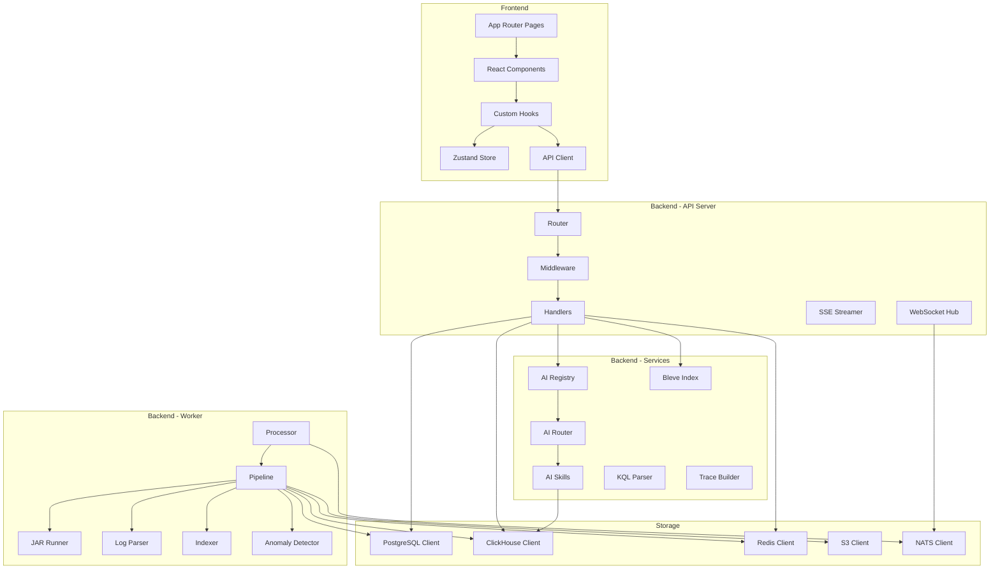

# Components

This document provides a detailed breakdown of each component in the RemedyIQ system.

## Component Architecture



## Frontend Components

### App Router Pages

| Path | File | Purpose |
|------|------|---------|
| `/` | `app/(dashboard)/page.tsx` | Dashboard home with job list |
| `/upload` | `app/(dashboard)/upload/page.tsx` | File upload interface |
| `/analysis/[id]` | `app/(dashboard)/analysis/[id]/page.tsx` | Analysis detail view |
| `/explorer/[id]` | `app/(dashboard)/explorer/[id]/page.tsx` | Log explorer with KQL |
| `/trace/[id]` | `app/(dashboard)/trace/[id]/page.tsx` | Trace waterfall view |
| `/ai/[id]` | `app/(dashboard)/ai/[id]/page.tsx` | AI assistant |

### React Components

#### Dashboard Components

| Component | File | Purpose |
|-----------|------|---------|
| `StatsCards` | `components/dashboard/stats-cards.tsx` | General statistics cards |
| `TopAPICalls` | `components/dashboard/top-api-calls.tsx` | Top N slow API calls |
| `TopSQL` | `components/dashboard/top-sql.tsx` | Top N slow SQL statements |
| `TopFilters` | `components/dashboard/top-filters.tsx` | Top N filter executions |
| `ExceptionsTable` | `components/dashboard/exceptions-table.tsx` | Error list |
| `TimeSeriesChart` | `components/dashboard/time-series-chart.tsx` | Activity over time |
| `HealthScore` | `components/dashboard/health-score.tsx` | System health indicator |

#### Explorer Components

| Component | File | Purpose |
|-----------|------|---------|
| `SearchBar` | `components/explorer/search-bar.tsx` | KQL input with autocomplete |
| `FilterPanel` | `components/explorer/filter-panel.tsx` | Type, user, time filters |
| `ResultsTable` | `components/explorer/results-table.tsx` | Search results |
| `EntryDetail` | `components/explorer/entry-detail.tsx` | Log entry detail modal |

#### Trace Components

| Component | File | Purpose |
|-----------|------|---------|
| `WaterfallChart` | `components/trace/waterfall-chart.tsx` | Span waterfall visualization |
| `SpanTree` | `components/trace/span-tree.tsx` | Hierarchical span tree |
| `SpanDetail` | `components/trace/span-detail.tsx` | Individual span details |
| `CriticalPath` | `components/trace/critical-path.tsx` | Critical path highlighting |

#### AI Components

| Component | File | Purpose |
|-----------|------|---------|
| `ChatInterface` | `components/ai/chat-interface.tsx` | Main chat UI |
| `MessageList` | `components/ai/message-list.tsx` | Conversation messages |
| `StreamingMessage` | `components/ai/streaming-message.tsx` | SSE stream renderer |
| `SkillSelector` | `components/ai/skill-selector.tsx` | Manual skill selection |
| `SuggestedQueries` | `components/ai/suggested-queries.tsx` | Query suggestions |

### Custom Hooks

| Hook | File | Purpose |
|------|------|---------|
| `useJobProgress` | `hooks/use-job-progress.ts` | WebSocket job progress |
| `useSearch` | `hooks/use-search.ts` | KQL search with pagination |
| `useConversation` | `hooks/use-conversation.ts` | AI conversation management |
| `useSSEStream` | `hooks/use-sse-stream.ts` | SSE connection handling |

## Backend Components

### API Server (`cmd/api`)

Entry point: `main.go`

**Responsibilities:**
1. Initialize all dependencies (database clients, NATS, Redis)
2. Build handler chain with dependency injection
3. Configure middleware stack
4. Start HTTP server

**Startup Sequence:**
```
Load Config → Connect DB → Connect NATS → Connect Redis → Build Handlers → Start Server
```

### Handlers (`internal/api/handlers`)

| Handler File | Endpoints | Purpose |
|--------------|-----------|---------|
| `files.go` | `/files/*` | Upload and list files |
| `analysis.go` | `/analysis/*` | Create and list jobs |
| `dashboard.go` | `/analysis/{id}/dashboard` | Get dashboard data |
| `aggregates.go` | `/dashboard/aggregates` | Aggregation data |
| `exceptions.go` | `/dashboard/exceptions` | Error data |
| `gaps.go` | `/dashboard/gaps` | Idle period data |
| `threads.go` | `/dashboard/threads` | Thread statistics |
| `filters.go` | `/dashboard/filters` | Filter complexity |
| `search.go` | `/analysis/{id}/search` | KQL search |
| `trace.go` | `/analysis/{id}/trace/*` | Trace data |
| `ai.go` | `/ai/*` | AI skills and conversations |
| `ai_stream.go` | `/ai/stream` | SSE streaming |
| `conversations.go` | `/ai/conversations` | Conversation CRUD |
| `export.go` | `/search/export` | CSV/JSON export |
| `upload.go` | `/files/upload` | Multipart upload |
| `stream.go` | `/ws` | WebSocket handler |

### Middleware (`internal/api/middleware`)

| Middleware | File | Purpose |
|------------|------|---------|
| Recovery | `recovery.go` | Panic recovery |
| Logging | `logging.go` | Request logging |
| CORS | `cors.go` | Cross-origin headers |
| Body Limit | `body_limit.go` | 10MB request limit |
| Auth | `auth.go` | Clerk JWT validation |
| Tenant | `tenant.go` | org_id extraction |

### Worker Service (`cmd/worker`)

Entry point: `main.go`

**Responsibilities:**
1. Subscribe to NATS job queue
2. Process jobs through pipeline
3. Report progress via NATS

**Components:**

| Component | File | Purpose |
|-----------|------|---------|
| Processor | `worker/processor.go` | NATS subscription, job dispatch |
| Pipeline | `worker/ingestion.go` | Orchestrate processing stages |
| Anomaly | `worker/anomaly.go` | Statistical anomaly detection |
| Indexer | `worker/indexer.go` | Bleve index building |

### AI Service (`internal/ai`)

| Component | File | Purpose |
|-----------|------|---------|
| Registry | `ai/registry.go` | Skill registration and lookup |
| Router | `ai/router.go` | Query-to-skill routing |
| Gemini Client | `ai/gemini_client.go` | Google Gemini API client |
| Skills | `ai/skills/*.go` | Individual skill implementations |

### Search Service (`internal/search`)

| Component | File | Purpose |
|-----------|------|---------|
| KQL Parser | `search/kql.go` | Parse KQL queries |
| Bleve Index | `search/bleve.go` | Full-text index management |

### Trace Service (`internal/trace`)

| Component | File | Purpose |
|-----------|------|---------|
| Builder | `trace/builder.go` | Build span hierarchy |
| Critical Path | `trace/critical.go` | Identify critical path |

## Storage Clients (`internal/storage`)

### PostgreSQL (`postgres.go`)

**Methods:**
- `Ping(ctx)` - Health check
- `SetTenantContext(ctx, tenantID)` - Set RLS variable
- `CreateLogFile(ctx, file)` - Insert file record
- `CreateAnalysisJob(ctx, job)` - Insert job record
- `UpdateJobStatus(ctx, tenantID, jobID, status, errorMsg)` - Update status
- `GetLogFile(ctx, tenantID, fileID)` - Get file metadata
- `ListAnalysisJobs(ctx, tenantID)` - List jobs

### ClickHouse (`clickhouse.go`)

**Methods:**
- `Ping(ctx)` - Health check
- `BatchInsertEntries(ctx, entries)` - Batch insert log entries
- `QueryEntries(ctx, query)` - Query log entries
- `GetDashboardData(ctx, jobID)` - Aggregate dashboard data

### Redis (`redis.go`)

**Methods:**
- `Get(ctx, key)` - Get cached value
- `Set(ctx, key, value, ttl)` - Cache value with TTL
- `TenantKey(tenantID, parts...)` - Build tenant-prefixed key

### S3 (`s3.go`)

**Methods:**
- `Upload(ctx, key, reader)` - Upload file
- `Download(ctx, key)` - Download file stream
- `Delete(ctx, key)` - Delete file

### NATS (`streaming/nats.go`)

**Methods:**
- `PublishJobSubmit(ctx, tenantID, job)` - Publish job created
- `PublishJobProgress(ctx, tenantID, jobID, pct, status, message)` - Progress update
- `PublishJobComplete(ctx, tenantID, jobID, job)` - Job completion
- `SubscribeJobSubmit(ctx, tenantID, handler)` - Subscribe to jobs

## Configuration

All services read from environment variables via `internal/config`:

| Variable | Default | Description |
|----------|---------|-------------|
| `PORT` | `8080` | API server port |
| `DATABASE_URL` | - | PostgreSQL connection string |
| `CLICKHOUSE_URL` | - | ClickHouse connection string |
| `REDIS_URL` | - | Redis connection string |
| `NATS_URL` | - | NATS connection string |
| `S3_ENDPOINT` | - | MinIO/S3 endpoint |
| `S3_ACCESS_KEY` | - | S3 access key |
| `S3_SECRET_KEY` | - | S3 secret key |
| `S3_BUCKET` | - | S3 bucket name |
| `CLERK_SECRET_KEY` | - | Clerk JWT secret |
| `GEMINI_API_KEY` | - | Google Gemini API key |
| `DEV_MODE` | `false` | Enable dev bypass |
