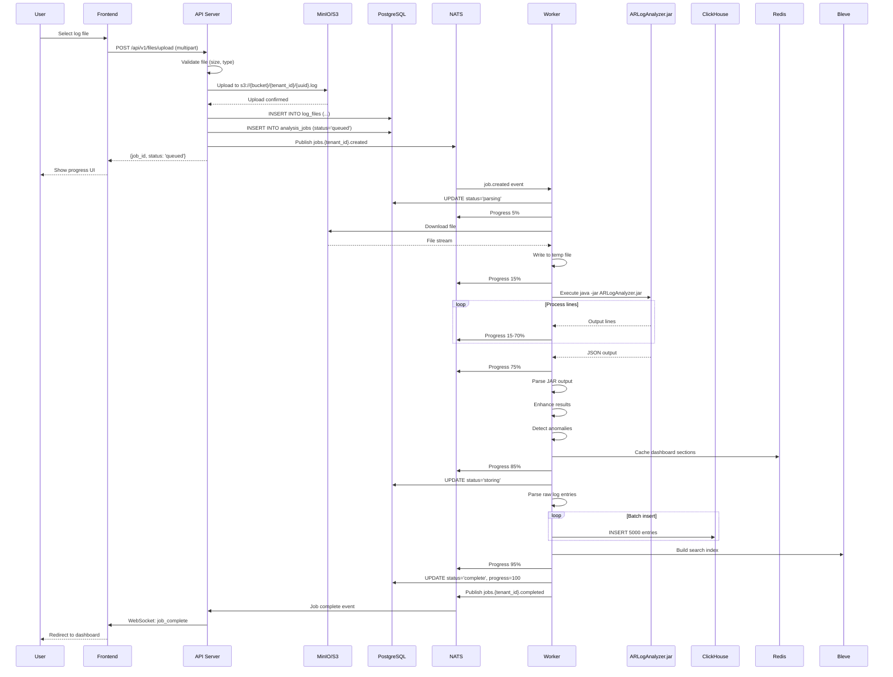
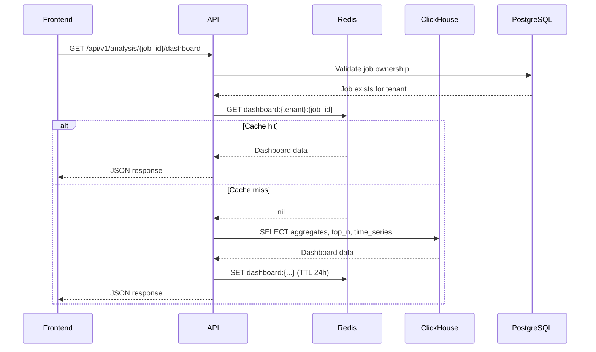
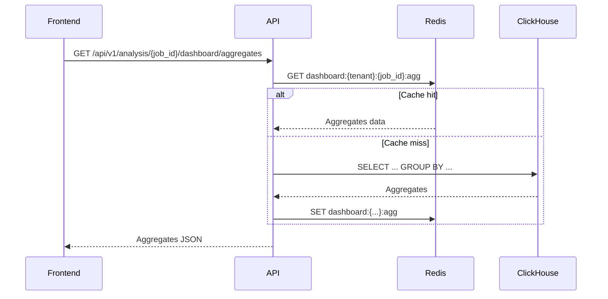
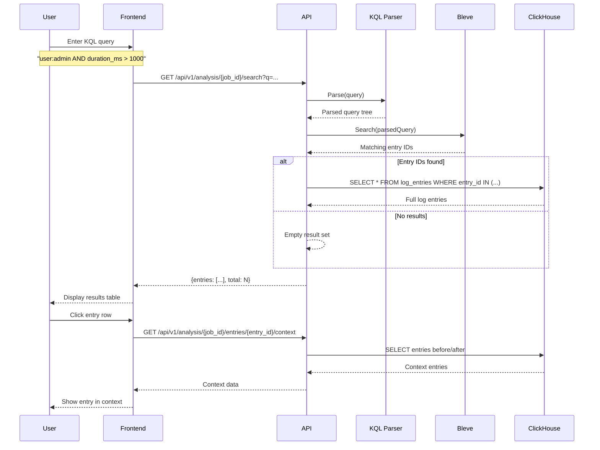
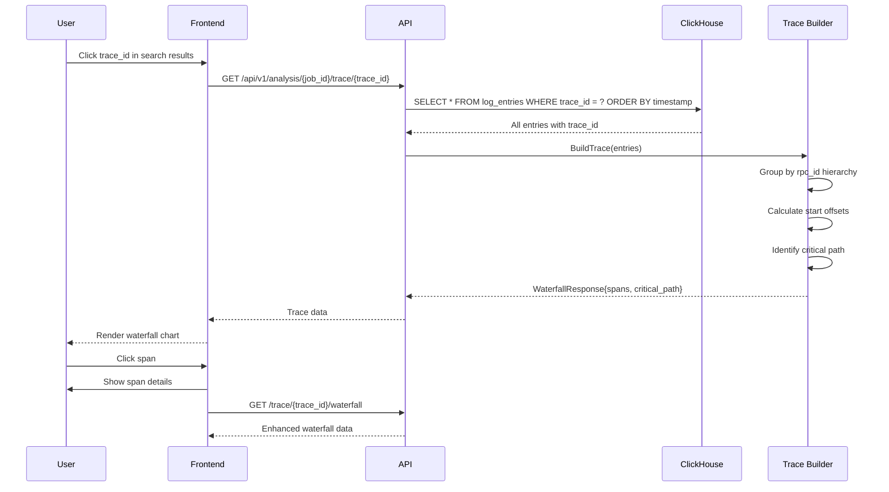
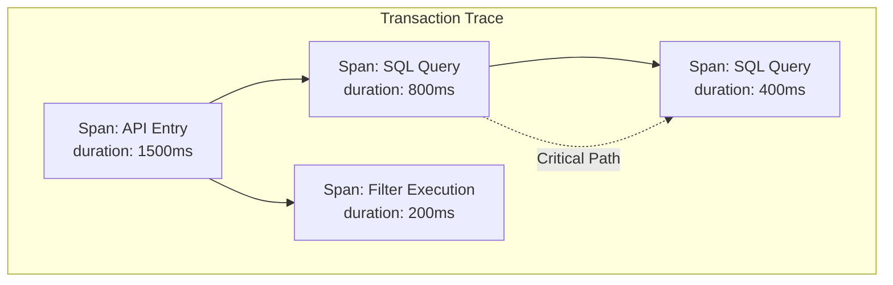
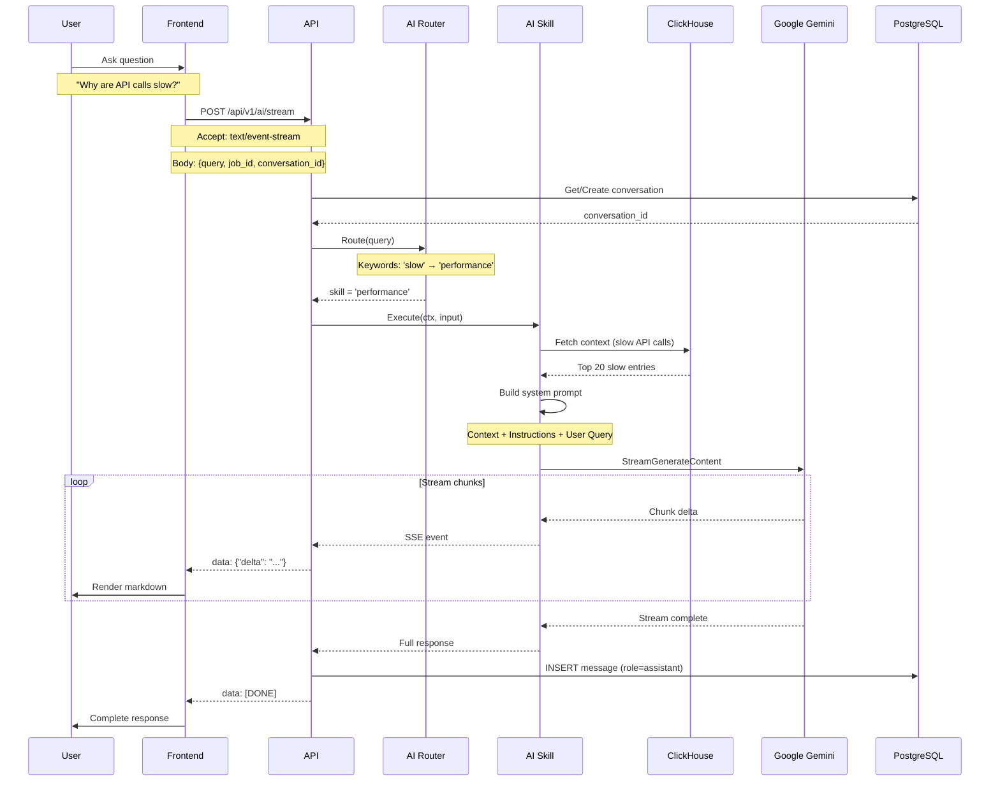
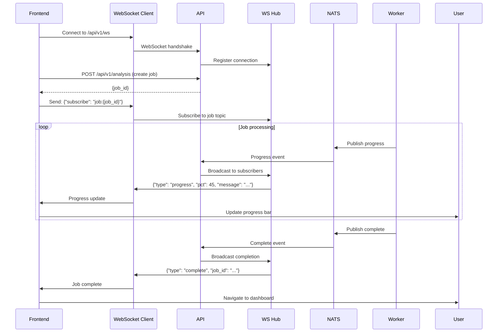

# Data Flow

This document explains the data flows between components with sequence diagrams.

## Table of Contents

1. [Log Upload & Analysis](#1-log-upload--analysis)
2. [Dashboard Loading](#2-dashboard-loading)
3. [KQL Search](#3-kql-search)
4. [Transaction Tracing](#4-transaction-tracing)
5. [AI Query Streaming](#5-ai-query-streaming)
6. [Real-time Progress Updates](#6-real-time-progress-updates)

---

## 1. Log Upload & Analysis

The complete flow from file upload to analysis completion.



---

## 2. Dashboard Loading

How dashboard data is fetched and cached.



### Lazy-Loaded Sections

Individual dashboard sections can be loaded independently:



---

## 3. KQL Search

Full-text and structured search flow.



### KQL Query Examples

| Query | Meaning |
|-------|---------|
| `user:admin` | Entries where user = 'admin' |
| `form:*Help*` | Forms containing 'Help' |
| `duration_ms > 5000` | Duration greater than 5 seconds |
| `type:API AND success:false` | Failed API calls |
| `error_message:*timeout*` | Timeout errors |

---

## 4. Transaction Tracing

Trace reconstruction and waterfall visualization.



### Trace Data Structure



---

## 5. AI Query Streaming

SSE-based streaming AI responses.



### SSE Event Format

```
data: {"delta": "Based on the log analysis, "}

data: {"delta": "the slowest API calls are related to "}

data: {"delta": "form submissions with an average "}

data: {"delta": "duration of 2.5 seconds."}

data: [DONE]
```

---

## 6. Real-time Progress Updates

WebSocket-based job progress updates.



### WebSocket Message Types

| Type | Direction | Purpose |
|------|-----------|---------|
| `subscribe` | Client → Server | Subscribe to job updates |
| `unsubscribe` | Client → Server | Unsubscribe from updates |
| `progress` | Server → Client | Job progress update |
| `complete` | Server → Client | Job completed |
| `error` | Server → Client | Job failed |
