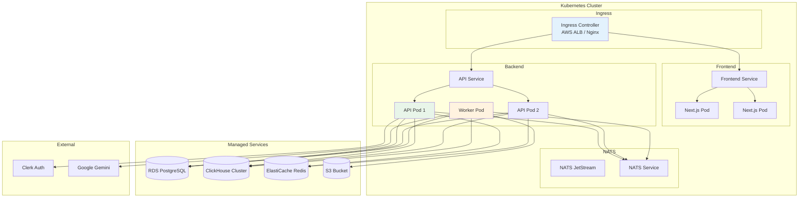
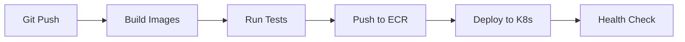

# Deployment

This document describes how to deploy RemedyIQ to Kubernetes using Helm.

## Deployment Architecture



## Helm Chart Structure

```
helm/remedyiq/
├── Chart.yaml
├── values.yaml
├── values-staging.yaml
├── values-prod.yaml
├── templates/
│   ├── _helpers.tpl
│   ├── api-deployment.yaml
│   ├── api-service.yaml
│   ├── api-hpa.yaml
│   ├── worker-deployment.yaml
│   ├── frontend-deployment.yaml
│   ├── frontend-service.yaml
│   ├── ingress.yaml
│   ├── configmap.yaml
│   ├── externalsecret.yaml
│   └── nats/
│       └── values.yaml
└── charts/
    └── nats/ (subchart)
```

## Components

### API Server

**Deployment Configuration:**

```yaml
apiVersion: apps/v1
kind: Deployment
metadata:
  name: remedyiq-api
spec:
  replicas: 2
  template:
    spec:
      containers:
        - name: api
          image: remedyiq/api:latest
          ports:
            - containerPort: 8080
          env:
            - name: DATABASE_URL
              valueFrom:
                secretKeyRef:
                  name: remedyiq-secrets
                  key: database-url
          resources:
            requests:
              cpu: 100m
              memory: 256Mi
            limits:
              cpu: 500m
              memory: 512Mi
```

**Horizontal Pod Autoscaler:**

```yaml
apiVersion: autoscaling/v2
kind: HorizontalPodAutoscaler
metadata:
  name: remedyiq-api-hpa
spec:
  scaleTargetRef:
    apiVersion: apps/v1
    kind: Deployment
    name: remedyiq-api
  minReplicas: 2
  maxReplicas: 10
  metrics:
    - type: Resource
      resource:
        name: cpu
        target:
          type: Utilization
          averageUtilization: 70
```

### Worker

**Deployment Configuration:**

```yaml
apiVersion: apps/v1
kind: Deployment
metadata:
  name: remedyiq-worker
spec:
  replicas: 1  # Single replica due to Bleve index
  template:
    spec:
      containers:
        - name: worker
          image: remedyiq/worker:latest
          volumeMounts:
            - name: bleve-index
              mountPath: /data/index
      volumes:
        - name: bleve-index
          persistentVolumeClaim:
            claimName: bleve-pvc
```

**Note**: Worker is intentionally deployed as a single replica because:
- Bleve index requires single-writer access
- PVC uses `ReadWriteOnce` access mode
- Multiple workers would cause index corruption

### Frontend

**Deployment Configuration:**

```yaml
apiVersion: apps/v1
kind: Deployment
metadata:
  name: remedyiq-frontend
spec:
  replicas: 2
  template:
    spec:
      containers:
        - name: frontend
          image: remedyiq/frontend:latest
          ports:
            - containerPort: 3000
          env:
            - name: NEXT_PUBLIC_API_URL
              value: "https://api.example.com"
            - name: NEXT_PUBLIC_CLERK_PUBLISHABLE_KEY
              valueFrom:
                secretKeyRef:
                  name: remedyiq-secrets
                  key: clerk-publishable-key
```

### NATS JetStream

Deployed as a subchart:

```yaml
nats:
  jetstream:
    enabled: true
    memStorage:
      enabled: true
      size: 1Gi
    fileStorage:
      enabled: true
      size: 10Gi
```

## Configuration

### Environment Variables

| Variable | Description | Secret |
|----------|-------------|--------|
| `DATABASE_URL` | PostgreSQL connection string | Yes |
| `CLICKHOUSE_URL` | ClickHouse connection string | Yes |
| `REDIS_URL` | Redis connection string | Yes |
| `S3_ACCESS_KEY` | MinIO/S3 access key | Yes |
| `S3_SECRET_KEY` | MinIO/S3 secret key | Yes |
| `CLERK_SECRET_KEY` | Clerk JWT secret | Yes |
| `GEMINI_API_KEY` | Google Gemini API key | Yes |
| `NATS_URL` | NATS connection URL | No |
| `S3_BUCKET` | S3 bucket name | No |
| `S3_ENDPOINT` | S3 endpoint URL | No |

### External Secrets

Managed by External Secrets Operator:

```yaml
apiVersion: external-secrets.io/v1beta1
kind: ExternalSecret
metadata:
  name: remedyiq-secrets
spec:
  refreshInterval: 1h
  secretStoreRef:
    name: aws-secretsmanager
    kind: ClusterSecretStore
  target:
    name: remedyiq-secrets
  data:
    - secretKey: database-url
      remoteRef:
        key: remedyiq/prod
        property: DATABASE_URL
```

## Deployment Process

### CI/CD Pipeline



### Manual Deployment

```bash
# Staging
helm upgrade --install remedyiq ./helm/remedyiq \
  -n remedyiq-staging \
  -f ./helm/remedyiq/values-staging.yaml

# Production
helm upgrade --install remedyiq ./helm/remedyiq \
  -n remedyiq-prod \
  -f ./helm/remedyiq/values-prod.yaml
```

## Scaling Considerations

### API Server

- Can scale horizontally with HPA
- Stateless - no local storage required
- All state in external services

### Worker

- Currently single replica (Bleve limitation)
- Future: Replace Bleve with distributed search

### Database

- PostgreSQL: Use RDS with read replicas
- ClickHouse: Deploy as cluster with replicas
- Redis: Use ElastiCache cluster mode

## Monitoring

### Health Endpoints

| Service | Endpoint | Purpose |
|---------|----------|---------|
| API | `/api/v1/health` | Liveness/readiness |
| Worker | Metrics port | Prometheus metrics |

### Metrics

- Request latency (p50, p95, p99)
- Error rate
- Active connections
- Job queue depth
- Cache hit rate

### Logging

Structured JSON logs shipped to CloudWatch/ELK:

```json
{
  "level": "info",
  "msg": "job completed",
  "job_id": "uuid",
  "tenant_id": "org_123",
  "duration_ms": 1234
}
```

## Disaster Recovery

### Backup Strategy

| Component | Backup Method | Frequency |
|-----------|---------------|-----------|
| PostgreSQL | RDS snapshots | Daily |
| ClickHouse | S3 backup | Daily |
| Redis | Not persistent | N/A |
| S3 files | Cross-region replication | Real-time |

### Recovery Procedure

1. **Database**: Restore from RDS snapshot
2. **ClickHouse**: Restore from S3 backup
3. **S3**: Promote replica region
4. **Redeploy**: Helm upgrade to restore services
