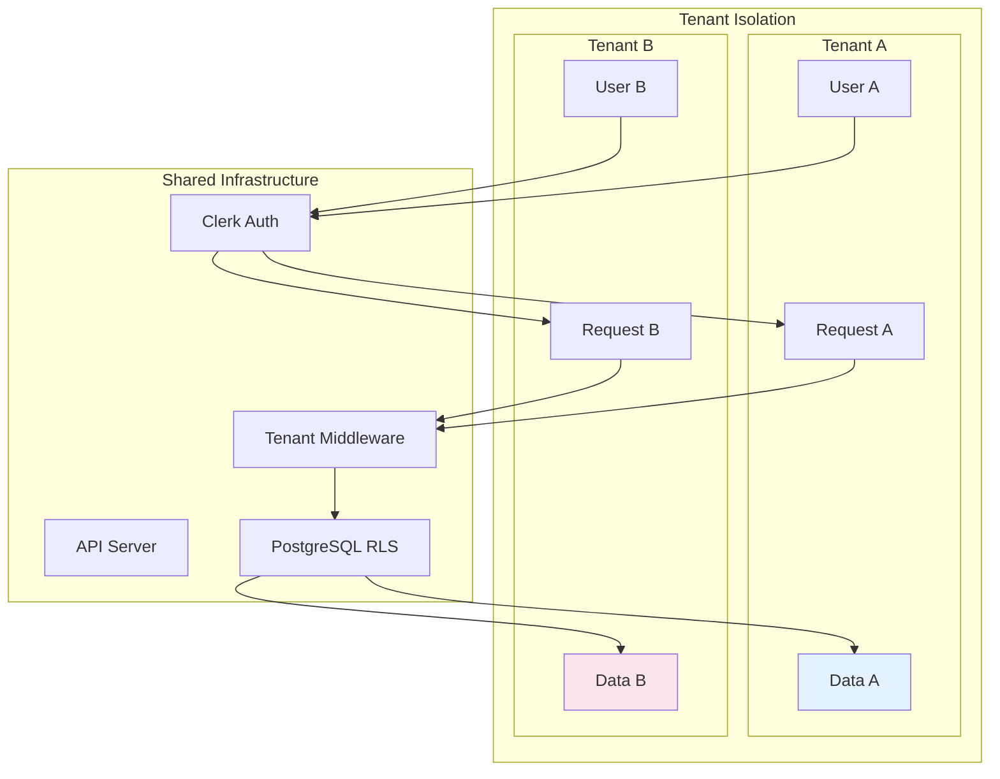
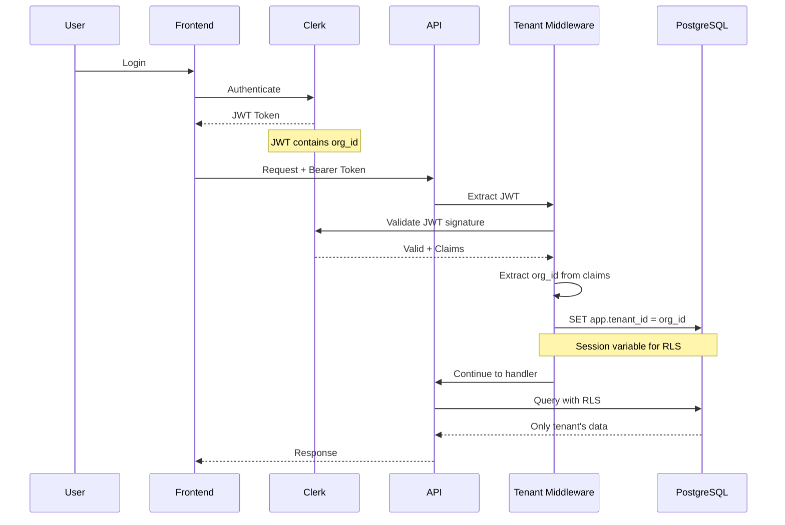
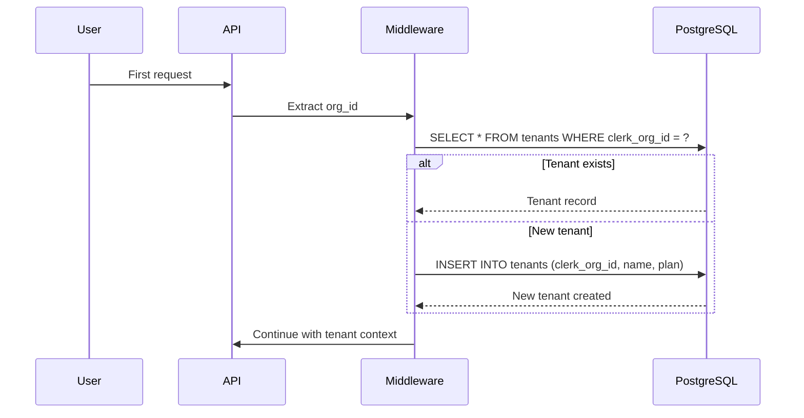

# Multi-Tenancy

This document explains how RemedyIQ implements multi-tenant isolation for enterprise deployments.

## Overview

RemedyIQ supports multiple organizations (tenants) sharing the same infrastructure while maintaining complete data isolation. Each tenant's data is logically separated at the application and database levels.



## Authentication Flow



## Isolation Layers

### 1. Authentication (Clerk)

Each tenant is a Clerk Organization with a unique `org_id`:

```json
{
  "sub": "user_123",
  "org_id": "org_abc123",
  "org_role": "admin",
  "email": "user@company.com"
}
```

### 2. Middleware (Tenant Injection)

The tenant middleware extracts `org_id` from the JWT and sets the PostgreSQL session variable:

```go
func (m *TenantMiddleware) InjectTenant(next http.Handler) http.Handler {
    return http.HandlerFunc(func(w http.ResponseWriter, r *http.Request) {
        claims := GetClaims(r.Context())
        orgID := claims["org_id"].(string)
        
        // Set session variable for RLS
        _, err := m.db.Exec(r.Context(), 
            "SET app.tenant_id = $1", orgID)
        
        next.ServeHTTP(w, r)
    })
}
```

### 3. Row-Level Security (PostgreSQL)

All tenant-scoped tables have RLS policies:

```sql
-- Enable RLS
ALTER TABLE log_files ENABLE ROW LEVEL SECURITY;

-- Create isolation policy
CREATE POLICY tenant_isolation ON log_files
    USING (tenant_id::TEXT = current_setting('app.tenant_id', true))
    WITH CHECK (tenant_id::TEXT = current_setting('app.tenant_id', true));
```

### 4. Storage Isolation (S3/MinIO)

Files are stored with tenant-prefixed paths:

```
s3://bucket/
├── org_abc123/
│   ├── uuid-1.log
│   └── uuid-2.log
└── org_def456/
    ├── uuid-3.log
    └── uuid-4.log
```

### 5. Message Queue Isolation (NATS)

Jobs are published to tenant-specific subjects:

```
jobs.{tenant_id}.created
jobs.{tenant_id}.progress
jobs.{tenant_id}.completed
```

### 6. Cache Isolation (Redis)

Cache keys include tenant prefix:

```
{tenant_id}:dashboard:{job_id}
{tenant_id}:dashboard:{job_id}:agg
{tenant_id}:search:{query_hash}
```

### 7. ClickHouse Isolation

Log entries include `tenant_id` column and are partitioned by tenant:

```sql
PARTITION BY (tenant_id, toYYYYMM(timestamp))
ORDER BY (tenant_id, job_id, log_type, timestamp, line_number)
```

## Tenant Provisioning

### Automatic Provisioning

Tenants are auto-provisioned on first login:



### Tenant Plans

| Plan | Storage Limit | Features |
|------|---------------|----------|
| free | 10 GB | Basic analysis |
| pro | 100 GB | AI assistant, advanced analytics |
| enterprise | Unlimited | All features, SSO, SLA |

## Security Considerations

### JWT Validation

Every request validates the JWT:

1. **Signature verification** - Ensure token wasn't tampered
2. **Expiration check** - Reject expired tokens
3. **Organization membership** - Verify user belongs to org

### RLS Policy Enforcement

RLS policies are enforced at the database level:

- Cannot be bypassed by application code
- Works even with direct SQL access
- Auditable at database level

### Development Mode

In development, authentication can be bypassed:

```bash
DEV_MODE=true
```

This allows testing with header-based tenant selection:

```
X-Dev-User-ID: user_123
X-Dev-Tenant-ID: org_abc123
```

**Warning**: Never enable dev mode in production!

## Data Migration

When moving data between tenants:

1. **Export** - Export data with tenant_id filter
2. **Transform** - Replace tenant_id values
3. **Import** - Import with new tenant context

```sql
-- Export tenant data
COPY (SELECT * FROM log_entries WHERE tenant_id = 'org_abc')
TO '/tmp/export.csv';

-- Import with new tenant
COPY log_entries FROM '/tmp/import.csv';
UPDATE log_entries 
SET tenant_id = 'org_new' 
WHERE tenant_id = 'org_abc';
```

## Audit Logging

All tenant operations are logged:

| Event | Logged Fields |
|-------|---------------|
| Tenant created | org_id, name, plan |
| File uploaded | org_id, file_id, size |
| Job created | org_id, job_id, file_id |
| AI query | org_id, job_id, skill, tokens |

## Best Practices

1. **Always use parameterized queries** - Prevent SQL injection
2. **Never trust client-provided tenant IDs** - Extract from JWT only
3. **Set RLS before every query** - Middleware handles this
4. **Use tenant-prefixed keys** - For all cache and storage
5. **Log tenant context** - For debugging and audit
