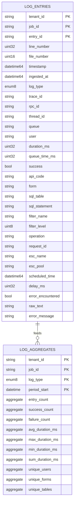

# ClickHouse Schema

This document describes the ClickHouse database schema for storing log entries and pre-computed aggregates.

## Overview

ClickHouse is used for high-volume log entry storage with time-series optimization. It stores individual log entries and maintains pre-computed aggregates via materialized views.

## Schema Diagram



## Tables

### log_entries

Main table for storing parsed log entries.

```sql
CREATE TABLE IF NOT EXISTS remedyiq.log_entries (
    tenant_id       String,
    job_id          String,
    entry_id        String DEFAULT generateUUIDv4(),
    line_number     UInt32,
    file_number     UInt16 DEFAULT 1,
    timestamp       DateTime64(3),
    ingested_at     DateTime64(3) DEFAULT now64(3),
    log_type        Enum8('API' = 1, 'SQL' = 2, 'FLTR' = 3, 'ESCL' = 4),
    trace_id        String DEFAULT '',
    rpc_id          String DEFAULT '',
    thread_id       String DEFAULT '',
    queue           String DEFAULT '',
    user            String DEFAULT '',
    duration_ms     UInt32 DEFAULT 0,
    queue_time_ms   UInt32 DEFAULT 0,
    success         Bool DEFAULT true,
    api_code        String DEFAULT '',
    form            String DEFAULT '',
    sql_table       String DEFAULT '',
    sql_statement   String DEFAULT '',
    filter_name     String DEFAULT '',
    filter_level    UInt8 DEFAULT 0,
    operation       String DEFAULT '',
    request_id      String DEFAULT '',
    esc_name        String DEFAULT '',
    esc_pool        String DEFAULT '',
    scheduled_time  Nullable(DateTime64(3)),
    delay_ms        UInt32 DEFAULT 0,
    error_encountered Bool DEFAULT false,
    raw_text        String DEFAULT '',
    error_message   String DEFAULT ''
)
ENGINE = MergeTree()
PARTITION BY (tenant_id, toYYYYMM(timestamp))
ORDER BY (tenant_id, job_id, log_type, timestamp, line_number)
TTL toDateTime(timestamp) + INTERVAL 90 DAY DELETE
SETTINGS index_granularity = 8192;
```

#### Engine Configuration

| Setting | Value | Purpose |
|---------|-------|---------|
| Engine | MergeTree | High-performance inserts and queries |
| Partition | (tenant_id, toYYYYMM(timestamp)) | Monthly partitions per tenant |
| Order | (tenant_id, job_id, log_type, timestamp, line_number) | Query optimization |
| TTL | 90 days | Automatic data retention |
| index_granularity | 8192 | Default granularity |

#### Column Details

| Column | Type | Description |
|--------|------|-------------|
| tenant_id | String | Tenant identifier for isolation |
| job_id | String | Analysis job ID |
| entry_id | String | Unique entry ID (UUID) |
| line_number | UInt32 | Line number in original file |
| file_number | UInt16 | File number for multi-file logs |
| timestamp | DateTime64(3) | Log entry timestamp (ms precision) |
| ingested_at | DateTime64(3) | When entry was ingested |
| log_type | Enum8 | API, SQL, FLTR, or ESCL |
| trace_id | String | Transaction trace ID |
| rpc_id | String | RPC ID within trace |
| thread_id | String | Server thread ID |
| queue | String | Server queue name |
| user | String | AR System user |
| duration_ms | UInt32 | Operation duration |
| queue_time_ms | UInt32 | Queue wait time |
| success | Bool | Operation success flag |
| raw_text | String | Original log line text |

#### Log Types

| Value | Enum | Description |
|-------|------|-------------|
| 1 | API | API log entries |
| 2 | SQL | SQL log entries |
| 3 | FLTR | Filter log entries |
| 4 | ESCL | Escalation log entries |

### log_entries_aggregates

Materialized view for pre-computed aggregations.

```sql
CREATE MATERIALIZED VIEW IF NOT EXISTS remedyiq.log_entries_aggregates
ENGINE = AggregatingMergeTree()
PARTITION BY (tenant_id, toYYYYMM(period_start))
ORDER BY (tenant_id, job_id, log_type, period_start)
AS SELECT
    tenant_id,
    job_id,
    log_type,
    toStartOfMinute(timestamp) AS period_start,
    countState() AS entry_count,
    countIfState(success = true) AS success_count,
    countIfState(success = false) AS failure_count,
    avgState(duration_ms) AS avg_duration_ms,
    maxState(duration_ms) AS max_duration_ms,
    minState(duration_ms) AS min_duration_ms,
    sumState(duration_ms) AS sum_duration_ms,
    uniqExactState(user) AS unique_users,
    uniqExactState(form) AS unique_forms,
    uniqExactState(sql_table) AS unique_tables
FROM remedyiq.log_entries
GROUP BY tenant_id, job_id, log_type, period_start;
```

#### Aggregate Functions

The materialized view stores intermediate aggregation states using `-State` variants:

| Column | State Function | Merge Function |
|--------|---------------|----------------|
| entry_count | countState() | countMerge() |
| success_count | countIfState() | countIfMerge() |
| failure_count | countIfState() | countIfMerge() |
| avg_duration_ms | avgState() | avgMerge() |
| max_duration_ms | maxState() | maxMerge() |
| min_duration_ms | minState() | minMerge() |
| sum_duration_ms | sumState() | sumMerge() |
| unique_users | uniqExactState() | uniqExactMerge() |
| unique_forms | uniqExactState() | uniqExactMerge() |
| unique_tables | uniqExactState() | uniqExactMerge() |

#### Querying Aggregates

To query the materialized view, use `-Merge` functions:

```sql
SELECT
    tenant_id,
    job_id,
    log_type,
    period_start,
    countMerge(entry_count) AS entry_count,
    avgMerge(avg_duration_ms) AS avg_duration_ms
FROM remedyiq.log_entries_aggregates
WHERE tenant_id = 'org_123'
  AND job_id = 'job_456'
GROUP BY tenant_id, job_id, log_type, period_start
ORDER BY period_start;
```

## Query Patterns

### Dashboard Data

```sql
SELECT
    count() AS total_lines,
    countIf(log_type = 'API') AS api_count,
    countIf(log_type = 'SQL') AS sql_count,
    countIf(log_type = 'FLTR') AS filter_count,
    countIf(log_type = 'ESCL') AS esc_count,
    uniqExact(user) AS unique_users,
    uniqExact(form) AS unique_forms,
    min(timestamp) AS log_start,
    max(timestamp) AS log_end
FROM remedyiq.log_entries
WHERE tenant_id = {tenant_id} AND job_id = {job_id};
```

### Top N Slow API Calls

```sql
SELECT
    entry_id,
    line_number,
    timestamp,
    trace_id,
    form,
    user,
    duration_ms,
    queue_time_ms,
    success,
    api_code,
    raw_text
FROM remedyiq.log_entries
WHERE tenant_id = {tenant_id}
  AND job_id = {job_id}
  AND log_type = 'API'
ORDER BY duration_ms DESC
LIMIT 20;
```

### Error Entries

```sql
SELECT
    entry_id,
    line_number,
    timestamp,
    trace_id,
    log_type,
    error_message,
    raw_text
FROM remedyiq.log_entries
WHERE tenant_id = {tenant_id}
  AND job_id = {job_id}
  AND success = false
ORDER BY timestamp
LIMIT 100;
```

### Time Series

```sql
SELECT
    toStartOfMinute(timestamp) AS minute,
    log_type,
    count() AS count,
    avg(duration_ms) AS avg_duration
FROM remedyiq.log_entries
WHERE tenant_id = {tenant_id}
  AND job_id = {job_id}
GROUP BY minute, log_type
ORDER BY minute, log_type;
```

### Trace Entries

```sql
SELECT
    entry_id,
    timestamp,
    trace_id,
    rpc_id,
    thread_id,
    log_type,
    duration_ms,
    form,
    operation,
    success
FROM remedyiq.log_entries
WHERE tenant_id = {tenant_id}
  AND job_id = {job_id}
  AND trace_id = {trace_id}
ORDER BY timestamp, rpc_id;
```

## Performance Considerations

### Partitioning

- **Monthly partitions**: Automatic by `(tenant_id, toYYYYMM(timestamp))`
- **TTL cleanup**: Old partitions are automatically dropped
- **Query optimization**: Always include `tenant_id` and `job_id` in WHERE clause

### Indexing

The primary key (ORDER BY) provides:
- Fast filtering by tenant and job
- Efficient time-range queries
- Log type filtering

### Batch Inserts

Log entries are inserted in batches of 5000:

```go
func (c *Client) BatchInsertEntries(ctx context.Context, entries []domain.LogEntry) error {
    batch, err := c.conn.PrepareBatch(ctx, 
        "INSERT INTO remedyiq.log_entries (*) VALUES (?, ?, ?, ...)")
    if err != nil {
        return err
    }
    
    for _, entry := range entries {
        if err := batch.Append(
            entry.TenantID,
            entry.JobID,
            // ... other fields
        ); err != nil {
            return err
        }
    }
    
    return batch.Send()
}
```

## Data Retention

- **TTL**: 90 days from `timestamp`
- **Automatic cleanup**: Old partitions are dropped
- **Manual cleanup**: `ALTER TABLE ... DELETE WHERE ...`

## Initialization

```bash
clickhouse-client < backend/migrations/clickhouse/001_init.sql
```

Or via make target:

```bash
make ch-init
```
