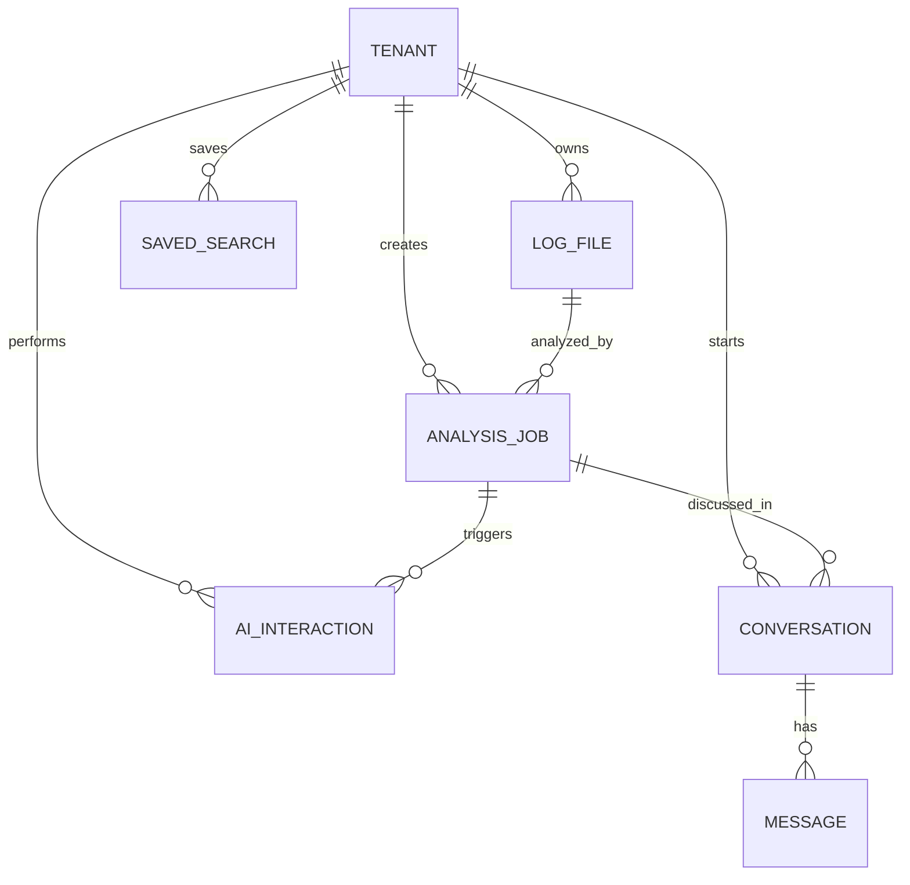

# PostgreSQL Schema

This document describes the PostgreSQL database schema for RemedyIQ.

## Overview

PostgreSQL stores metadata, tenant information, job status, and AI interactions. All tenant-scoped tables use Row-Level Security (RLS) for multi-tenant isolation.

## Schema Diagram



## Tables

### tenants

Primary entity for multi-tenant isolation.

```sql
CREATE TABLE IF NOT EXISTS tenants (
    id              UUID PRIMARY KEY DEFAULT gen_random_uuid(),
    clerk_org_id    TEXT UNIQUE NOT NULL,
    name            TEXT NOT NULL,
    plan            TEXT NOT NULL DEFAULT 'free',
    storage_limit_gb INTEGER NOT NULL DEFAULT 10,
    created_at      TIMESTAMPTZ NOT NULL DEFAULT NOW(),
    updated_at      TIMESTAMPTZ NOT NULL DEFAULT NOW()
);

ALTER TABLE tenants ENABLE ROW LEVEL SECURITY;

CREATE POLICY tenant_isolation ON tenants
    USING (id::TEXT = current_setting('app.tenant_id', true))
    WITH CHECK (id::TEXT = current_setting('app.tenant_id', true));
```

| Column | Type | Nullable | Default | Description |
|--------|------|----------|---------|-------------|
| id | UUID | No | gen_random_uuid() | Primary key |
| clerk_org_id | TEXT | No | - | Clerk organization ID |
| name | TEXT | No | - | Organization name |
| plan | TEXT | No | 'free' | Subscription plan |
| storage_limit_gb | INTEGER | No | 10 | Storage quota |
| created_at | TIMESTAMPTZ | No | NOW() | Creation timestamp |
| updated_at | TIMESTAMPTZ | No | NOW() | Last update timestamp |

### log_files

Metadata for uploaded log files.

```sql
CREATE TABLE IF NOT EXISTS log_files (
    id              UUID PRIMARY KEY DEFAULT gen_random_uuid(),
    tenant_id       UUID NOT NULL REFERENCES tenants(id),
    filename        TEXT NOT NULL,
    size_bytes      BIGINT NOT NULL,
    s3_key          TEXT NOT NULL,
    s3_bucket       TEXT NOT NULL,
    content_type    TEXT NOT NULL DEFAULT 'text/plain',
    detected_types  TEXT[] DEFAULT '{}',
    checksum_sha256 TEXT,
    uploaded_at     TIMESTAMPTZ NOT NULL DEFAULT NOW()
);

CREATE INDEX IF NOT EXISTS idx_files_tenant ON log_files(tenant_id);

ALTER TABLE log_files ENABLE ROW LEVEL SECURITY;

CREATE POLICY tenant_isolation ON log_files
    USING (tenant_id::TEXT = current_setting('app.tenant_id', true))
    WITH CHECK (tenant_id::TEXT = current_setting('app.tenant_id', true));
```

| Column | Type | Nullable | Default | Description |
|--------|------|----------|---------|-------------|
| id | UUID | No | gen_random_uuid() | Primary key |
| tenant_id | UUID | No | - | Foreign key to tenants |
| filename | TEXT | No | - | Original filename |
| size_bytes | BIGINT | No | - | File size in bytes |
| s3_key | TEXT | No | - | S3 object key |
| s3_bucket | TEXT | No | - | S3 bucket name |
| content_type | TEXT | No | 'text/plain' | MIME type |
| detected_types | TEXT[] | No | '{}' | Detected log types |
| checksum_sha256 | TEXT | Yes | - | SHA256 hash |
| uploaded_at | TIMESTAMPTZ | No | NOW() | Upload timestamp |

### analysis_jobs

Tracks the lifecycle of log analysis jobs.

```sql
CREATE TABLE IF NOT EXISTS analysis_jobs (
    id              UUID PRIMARY KEY DEFAULT gen_random_uuid(),
    tenant_id       UUID NOT NULL REFERENCES tenants(id),
    status          TEXT NOT NULL DEFAULT 'queued'
                    CHECK (status IN ('queued', 'parsing', 'analyzing', 'storing', 'complete', 'failed')),
    file_id         UUID NOT NULL REFERENCES log_files(id),
    jar_flags       JSONB NOT NULL DEFAULT '{}',
    jvm_heap_mb     INTEGER NOT NULL DEFAULT 4096,
    timeout_seconds INTEGER NOT NULL DEFAULT 1800,
    progress_pct    INTEGER NOT NULL DEFAULT 0,
    total_lines     BIGINT,
    processed_lines BIGINT,
    api_count       BIGINT,
    sql_count       BIGINT,
    filter_count    BIGINT,
    esc_count       BIGINT,
    start_time      TIMESTAMPTZ,
    end_time        TIMESTAMPTZ,
    log_start       TIMESTAMPTZ,
    log_end         TIMESTAMPTZ,
    log_duration    TEXT,
    error_message   TEXT,
    jar_stderr      TEXT,
    created_at      TIMESTAMPTZ NOT NULL DEFAULT NOW(),
    updated_at      TIMESTAMPTZ NOT NULL DEFAULT NOW(),
    completed_at    TIMESTAMPTZ
);

CREATE INDEX IF NOT EXISTS idx_jobs_tenant_status ON analysis_jobs(tenant_id, status);
CREATE INDEX IF NOT EXISTS idx_jobs_tenant_created ON analysis_jobs(tenant_id, created_at DESC);

ALTER TABLE analysis_jobs ENABLE ROW LEVEL SECURITY;

CREATE POLICY tenant_isolation ON analysis_jobs
    USING (tenant_id::TEXT = current_setting('app.tenant_id', true))
    WITH CHECK (tenant_id::TEXT = current_setting('app.tenant_id', true));
```

| Column | Type | Nullable | Default | Description |
|--------|------|----------|---------|-------------|
| id | UUID | No | gen_random_uuid() | Primary key |
| tenant_id | UUID | No | - | Foreign key to tenants |
| status | TEXT | No | 'queued' | Job status |
| file_id | UUID | No | - | Foreign key to log_files |
| jar_flags | JSONB | No | '{}' | JAR configuration |
| jvm_heap_mb | INTEGER | No | 4096 | JVM heap size |
| timeout_seconds | INTEGER | No | 1800 | Job timeout |
| progress_pct | INTEGER | No | 0 | Progress percentage |
| total_lines | BIGINT | Yes | - | Total log lines |
| api_count | BIGINT | Yes | - | API log count |
| sql_count | BIGINT | Yes | - | SQL log count |
| filter_count | BIGINT | Yes | - | Filter log count |
| esc_count | BIGINT | Yes | - | Escalation log count |
| error_message | TEXT | Yes | - | Error message |
| created_at | TIMESTAMPTZ | No | NOW() | Creation timestamp |
| completed_at | TIMESTAMPTZ | Yes | - | Completion timestamp |

**Status Values:**

| Status | Description |
|--------|-------------|
| queued | Job waiting for worker |
| parsing | Worker executing JAR |
| analyzing | Parsing JAR output |
| storing | Writing to ClickHouse |
| complete | Job finished successfully |
| failed | Job encountered error |

### ai_interactions

Records AI assistant interactions.

```sql
CREATE TABLE IF NOT EXISTS ai_interactions (
    id              UUID PRIMARY KEY DEFAULT gen_random_uuid(),
    tenant_id       UUID NOT NULL REFERENCES tenants(id),
    job_id          UUID REFERENCES analysis_jobs(id),
    user_id         TEXT NOT NULL,
    skill_name      TEXT NOT NULL,
    input_text      TEXT NOT NULL,
    output_text     TEXT,
    referenced_lines JSONB DEFAULT '[]',
    tokens_used     INTEGER,
    latency_ms      INTEGER,
    status          TEXT NOT NULL DEFAULT 'pending'
                    CHECK (status IN ('pending', 'processing', 'complete', 'failed')),
    created_at      TIMESTAMPTZ NOT NULL DEFAULT NOW()
);

CREATE INDEX IF NOT EXISTS idx_ai_tenant ON ai_interactions(tenant_id, created_at DESC);

ALTER TABLE ai_interactions ENABLE ROW LEVEL SECURITY;

CREATE POLICY tenant_isolation ON ai_interactions
    USING (tenant_id::TEXT = current_setting('app.tenant_id', true))
    WITH CHECK (tenant_id::TEXT = current_setting('app.tenant_id', true));
```

### conversations

AI conversation threads.

```sql
CREATE TABLE IF NOT EXISTS conversations (
    id            UUID PRIMARY KEY DEFAULT gen_random_uuid(),
    tenant_id     UUID NOT NULL REFERENCES tenants(id),
    user_id       TEXT NOT NULL,
    job_id        UUID NOT NULL REFERENCES analysis_jobs(id),
    title         TEXT NOT NULL,
    created_at    TIMESTAMPTZ NOT NULL DEFAULT NOW(),
    updated_at    TIMESTAMPTZ NOT NULL DEFAULT NOW(),
    message_count INTEGER NOT NULL DEFAULT 0,
    last_message_at TIMESTAMPTZ,
    metadata      JSONB DEFAULT '{}'
);

CREATE INDEX IF NOT EXISTS idx_conversations_tenant_user 
    ON conversations(tenant_id, user_id, updated_at DESC);

ALTER TABLE conversations ENABLE ROW LEVEL SECURITY;

CREATE POLICY tenant_isolation ON conversations
    USING (tenant_id::TEXT = current_setting('app.tenant_id', true))
    WITH CHECK (tenant_id::TEXT = current_setting('app.tenant_id', true));
```

### messages

Individual messages within conversations.

```sql
CREATE TABLE IF NOT EXISTS messages (
    id              UUID PRIMARY KEY DEFAULT gen_random_uuid(),
    conversation_id UUID NOT NULL REFERENCES conversations(id) ON DELETE CASCADE,
    tenant_id       UUID NOT NULL REFERENCES tenants(id),
    role            TEXT NOT NULL CHECK (role IN ('user', 'assistant')),
    content         TEXT NOT NULL,
    skill_name      TEXT,
    follow_ups      TEXT[],
    tokens_used     INTEGER DEFAULT 0,
    latency_ms      INTEGER DEFAULT 0,
    status          TEXT NOT NULL DEFAULT 'pending'
                    CHECK (status IN ('pending', 'streaming', 'complete', 'error')),
    error_message   TEXT,
    created_at      TIMESTAMPTZ NOT NULL DEFAULT NOW()
);

CREATE INDEX IF NOT EXISTS idx_messages_conversation 
    ON messages(conversation_id, created_at);

ALTER TABLE messages ENABLE ROW LEVEL SECURITY;

CREATE POLICY tenant_isolation ON messages
    USING (tenant_id::TEXT = current_setting('app.tenant_id', true))
    WITH CHECK (tenant_id::TEXT = current_setting('app.tenant_id', true));
```

### saved_searches

User-saved KQL queries.

```sql
CREATE TABLE IF NOT EXISTS saved_searches (
    id              UUID PRIMARY KEY DEFAULT gen_random_uuid(),
    tenant_id       UUID NOT NULL REFERENCES tenants(id),
    user_id         TEXT NOT NULL,
    name            TEXT NOT NULL,
    kql_query       TEXT NOT NULL,
    filters         JSONB DEFAULT '{}',
    is_pinned       BOOLEAN DEFAULT false,
    created_at      TIMESTAMPTZ NOT NULL DEFAULT NOW()
);

CREATE INDEX IF NOT EXISTS idx_saved_searches_tenant_id ON saved_searches(tenant_id);

ALTER TABLE saved_searches ENABLE ROW LEVEL SECURITY;

CREATE POLICY tenant_isolation ON saved_searches
    USING (tenant_id::TEXT = current_setting('app.tenant_id', true))
    WITH CHECK (tenant_id::TEXT = current_setting('app.tenant_id', true));
```

## Row-Level Security

All tables have RLS enabled with identical policies:

```sql
ALTER TABLE {table_name} ENABLE ROW LEVEL SECURITY;

CREATE POLICY tenant_isolation ON {table_name}
    USING (tenant_id::TEXT = current_setting('app.tenant_id', true))
    WITH CHECK (tenant_id::TEXT = current_setting('app.tenant_id', true));
```

The `app.tenant_id` session variable is set by the tenant middleware after JWT validation.

## Indexes

| Table | Index | Columns | Purpose |
|-------|-------|---------|---------|
| log_files | idx_files_tenant | tenant_id | Tenant file listing |
| analysis_jobs | idx_jobs_tenant_status | tenant_id, status | Filter by status |
| analysis_jobs | idx_jobs_tenant_created | tenant_id, created_at DESC | Recent jobs first |
| ai_interactions | idx_ai_tenant | tenant_id, created_at DESC | Recent interactions |
| conversations | idx_conversations_tenant_user | tenant_id, user_id, updated_at DESC | User conversations |
| messages | idx_messages_conversation | conversation_id, created_at | Message ordering |
| saved_searches | idx_saved_searches_tenant_id | tenant_id | Tenant searches |

## Migrations

Migrations are stored in `backend/migrations/`:

```
migrations/
├── 001_initial.up.sql
├── 001_initial.down.sql
├── 002_conversations.up.sql
└── 002_conversations.down.sql
```

Apply migrations:

```bash
make migrate-up
```

Rollback:

```bash
make migrate-down
```
