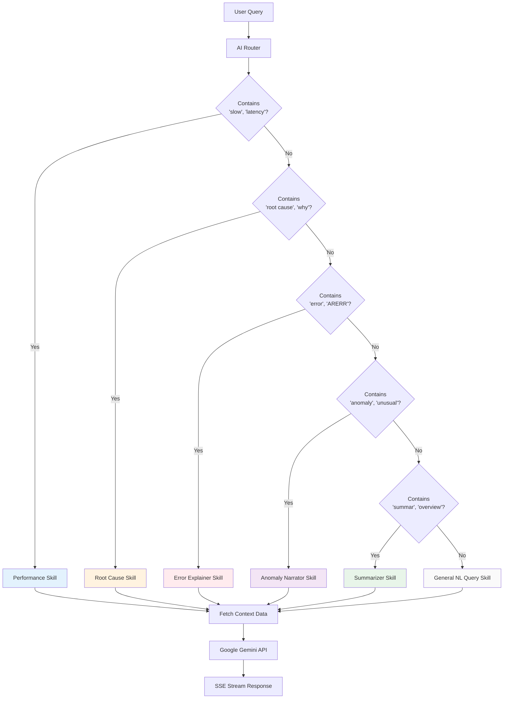
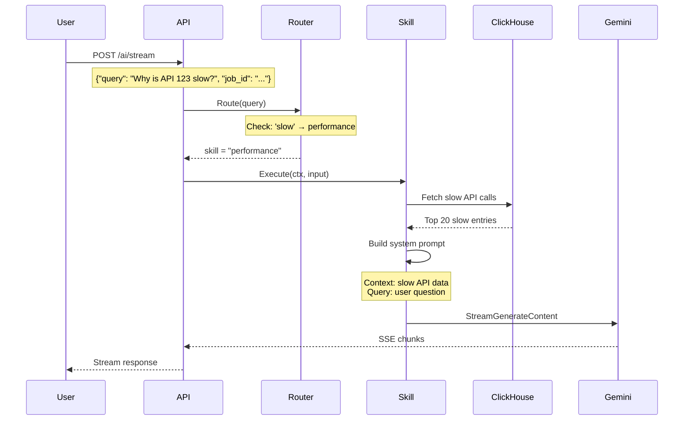
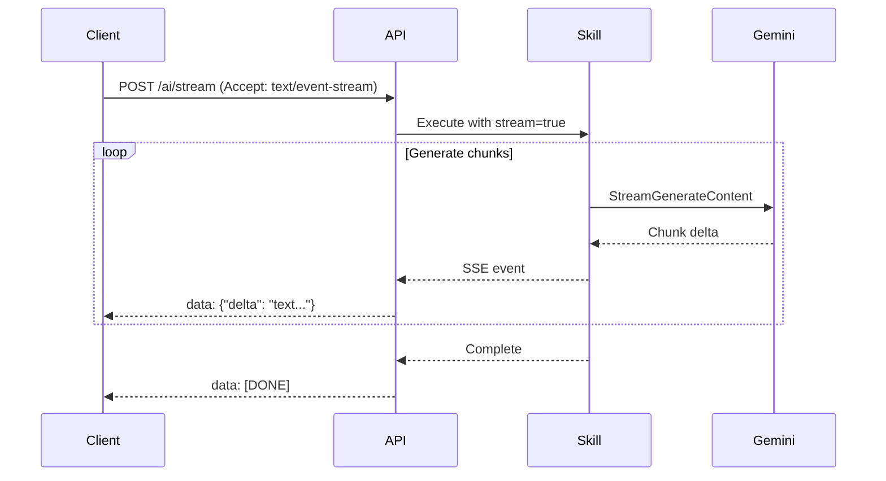
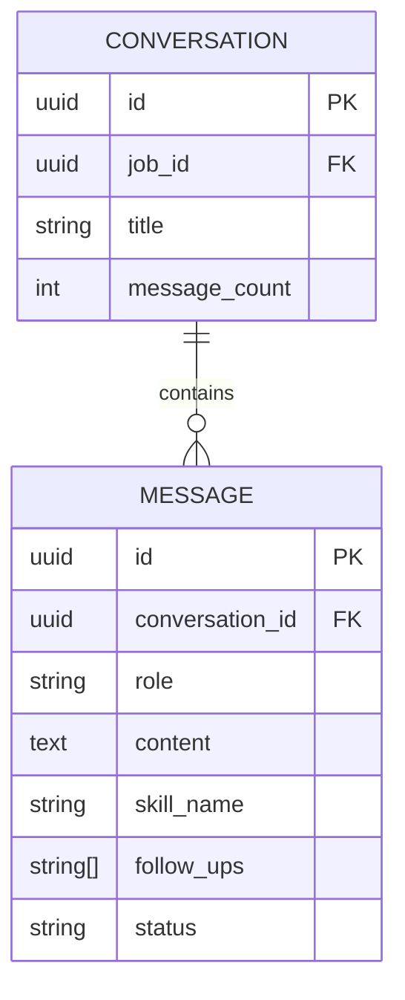

# AI Skill Router

This document describes how AI queries are routed to specialized skills.

## Router Overview



## Skill Registry

| Skill | Keywords | Purpose |
|-------|----------|---------|
| `performance` | slow, latency, duration, timeout, bottleneck, optimize, tuning, longest, slowest | Analyze slow operations |
| `root_cause` | root cause, correlat, why, cascading, spike | Find correlations and failures |
| `error_explainer` | error, arerr, err, exception, failed, stack trace | Explain error codes |
| `anomaly_narrator` | anomal, unusual, unexpected, deviation, outlier | Detect unusual patterns |
| `summarizer` | summar, overview, executive, brief, report | Generate summaries |
| `nl_query` | (fallback) | General natural language queries |

## Routing Flow



## Skill Details

### Performance Skill

**Purpose**: Analyze slow operations and latency issues.

**Keywords**: `slow`, `latency`, `duration`, `timeout`, `bottleneck`, `optimize`, `tuning`, `longest`, `slowest`

**Context Fetching**:
```sql
SELECT * FROM log_entries 
WHERE job_id = ? AND duration_ms > 1000
ORDER BY duration_ms DESC 
LIMIT 20
```

**Example Queries**:
- "Show me the slowest API calls"
- "Why is there high latency?"
- "What operations are taking more than 5 seconds?"

### Root Cause Skill

**Purpose**: Find correlations and cascading failures.

**Keywords**: `root cause`, `correlat`, `why`, `cascading`, `spike`

**Context Fetching**:
```sql
SELECT * FROM log_entries 
WHERE job_id = ? AND (success = false OR duration_ms > threshold)
ORDER BY timestamp
```

**Example Queries**:
- "Why did the system slow down at 3pm?"
- "What caused the cascade of failures?"
- "Find the root cause of these errors"

### Error Explainer Skill

**Purpose**: Explain error codes and exceptions.

**Keywords**: `error`, `arerr`, `err`, `exception`, `failed`, `stack trace`

**Context Fetching**:
```sql
SELECT * FROM log_entries 
WHERE job_id = ? AND success = false
ORDER BY timestamp DESC
LIMIT 50
```

**Example Queries**:
- "What does ARERR 123 mean?"
- "Explain these SQL exceptions"
- "Why am I getting error 45055?"

### Anomaly Narrator Skill

**Purpose**: Detect and explain unusual patterns.

**Keywords**: `anomal`, `unusual`, `unexpected`, `deviation`, `outlier`

**Context Fetching**:
```sql
SELECT * FROM log_entries 
WHERE job_id = ? AND duration_ms > (avg + 2 * stddev)
```

**Example Queries**:
- "Are there any anomalies in the data?"
- "What's unusual about today's logs?"
- "Find outliers in API response times"

### Summarizer Skill

**Purpose**: Generate overview summaries.

**Keywords**: `summar`, `overview`, `executive`, `brief`, `report`

**Context Fetching**:
```sql
SELECT 
    COUNT(*) as total,
    COUNTIf(success = true) as ok,
    AVG(duration_ms) as avg_duration
FROM log_entries 
WHERE job_id = ?
```

**Example Queries**:
- "Give me an executive summary"
- "Summarize the log analysis"
- "What's the overall health of the system?"

### NL Query Skill (Fallback)

**Purpose**: Handle general natural language queries.

**Keywords**: None (fallback for unmatched queries)

**Context Fetching**: General dashboard data and statistics.

**Example Queries**:
- "How many users were active?"
- "What forms were accessed most?"
- "Show me database operations"

## Streaming Response

All skills use Server-Sent Events (SSE) for streaming:



## Skill Interface

```go
type Skill interface {
    Name() string
    Description() string
    Execute(ctx context.Context, input SkillInput) (*SkillOutput, error)
    Examples() []string
}

type SkillInput struct {
    Query    string
    JobID    string
    TenantID string
    Context  map[string]interface{}
}

type SkillOutput struct {
    Answer     string
    References []LogReference
    FollowUps  []string
    Confidence float64
    SkillName  string
    TokensUsed int
    LatencyMS  int
}
```

## Conversation Persistence

Messages are stored in PostgreSQL for conversation history:



## Future Enhancements

1. **Semantic Routing**: Use embeddings to match queries to skills
2. **Skill Composition**: Chain multiple skills for complex queries
3. **Custom Skills**: Allow users to define domain-specific skills
4. **Feedback Loop**: Learn from user corrections to improve routing
