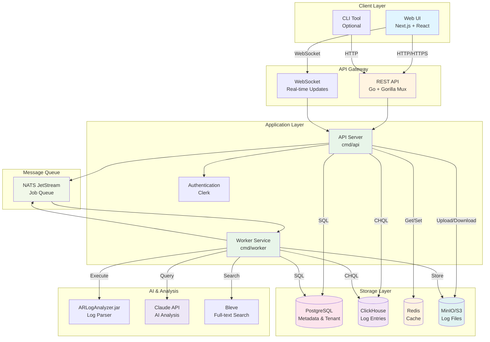
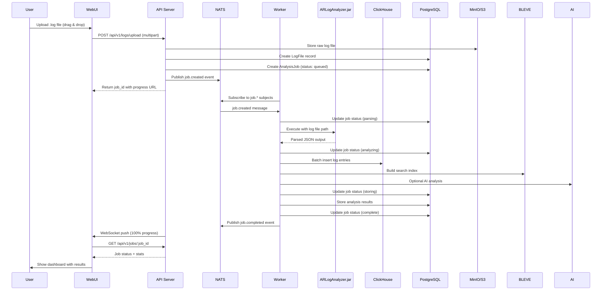
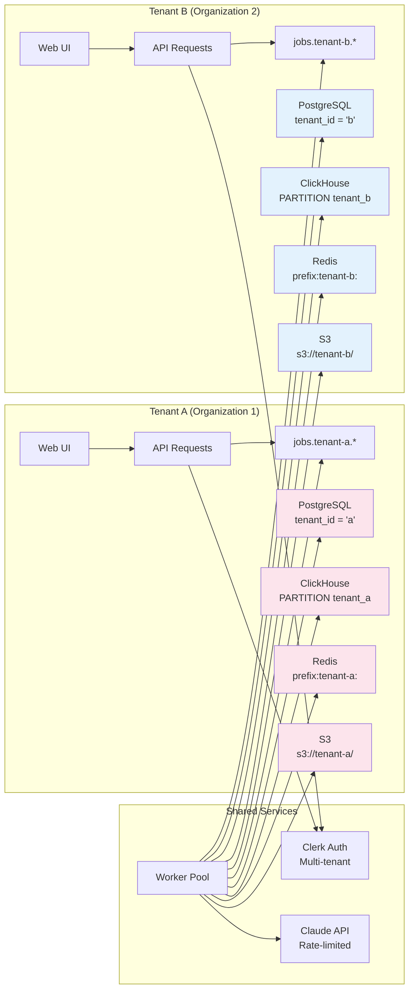
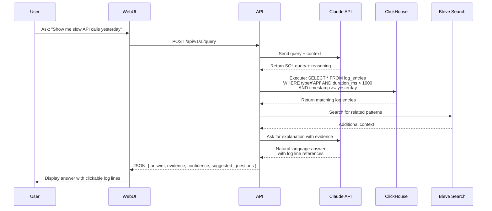
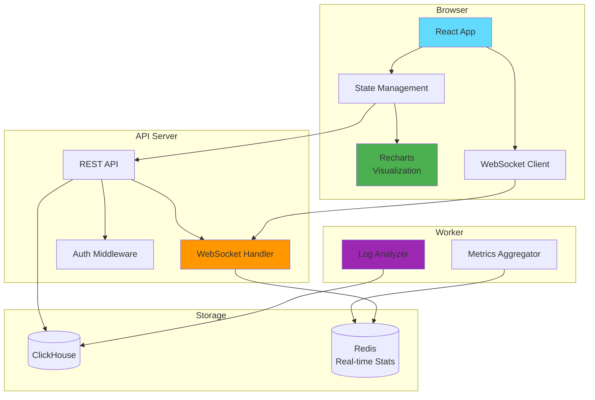
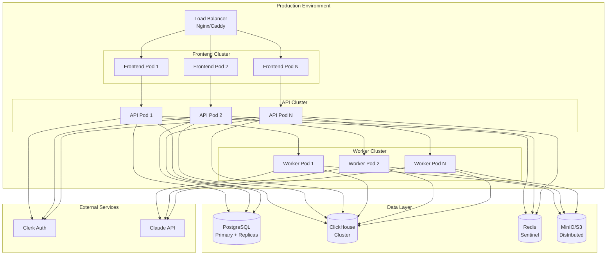

# RemedyIQ Architecture Diagrams

This directory contains architecture diagrams for the RemedyIQ platform.

## High-Level Architecture

## Data Flow - Log Upload & Analysis

## Multi-Tenant Architecture

## AI-Powered Query Flow

## Component Interaction - Real-time Dashboard

## Technology Stack

| Layer | Technology | Purpose |
|-------|-----------|---------|
| **Frontend** | Next.js 15, React 19, TypeScript | Web UI framework |
| **UI Components** | shadcn/ui, Radix UI, Tailwind CSS | Component library |
| **Charts** | Recharts | Data visualization |
| **API** | Go 1.24, Gorilla Mux | REST API server |
| **Real-time** | WebSocket, NATS JetStream | Live updates, job queue |
| **Database** | PostgreSQL + pgx/v5 | Metadata, tenant data |
| **Analytics** | ClickHouse | Time-series log data |
| **Cache** | Redis | Session, rate limiting, real-time stats |
| **Storage** | MinIO / S3 | Log file storage |
| **Search** | Bleve | Full-text search index |
| **AI** | Claude API (Anthropic) | Natural language query |
| **Auth** | Clerk | Multi-tenant authentication |
| **Infrastructure** | Docker, Docker Compose | Containerization |

## Deployment Architecture

