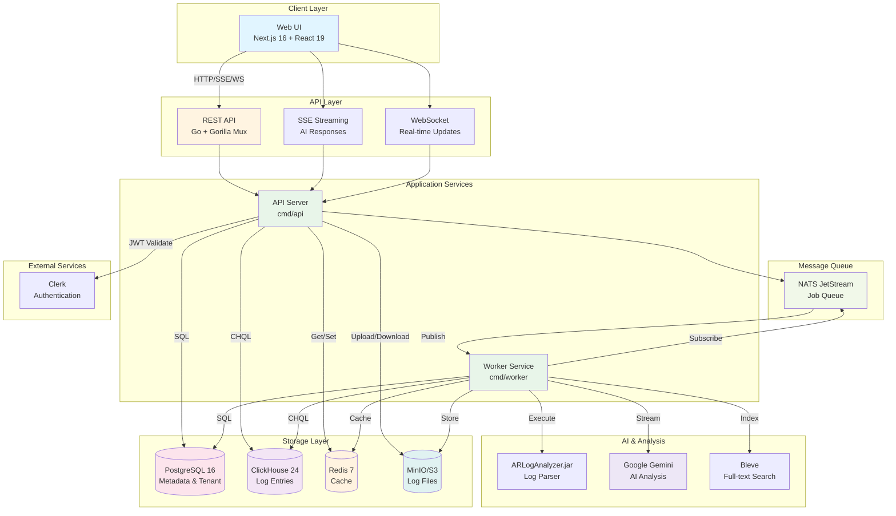
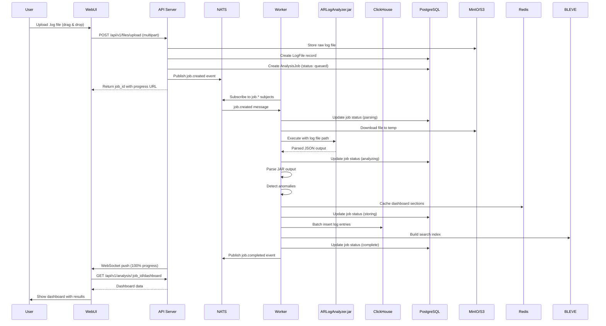
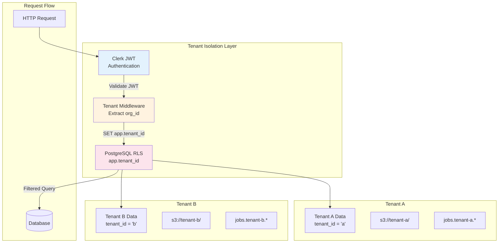
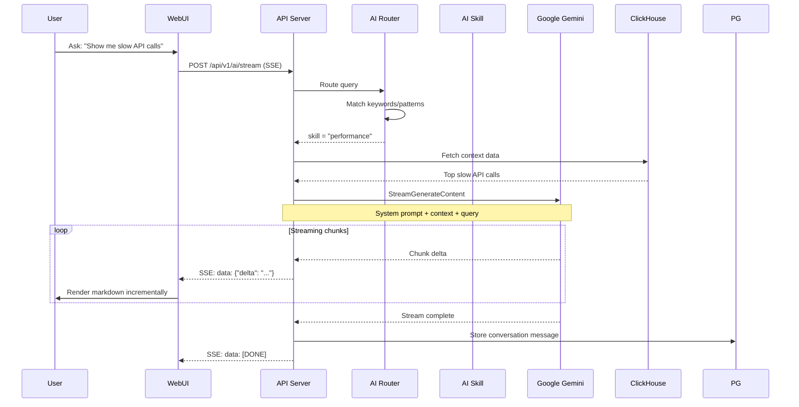
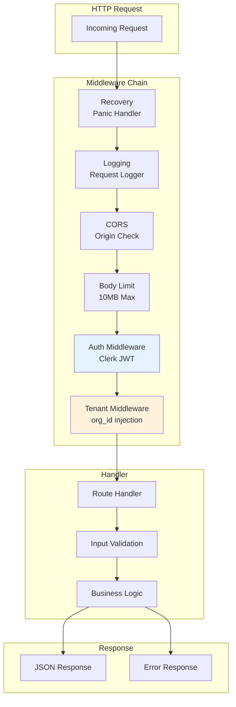
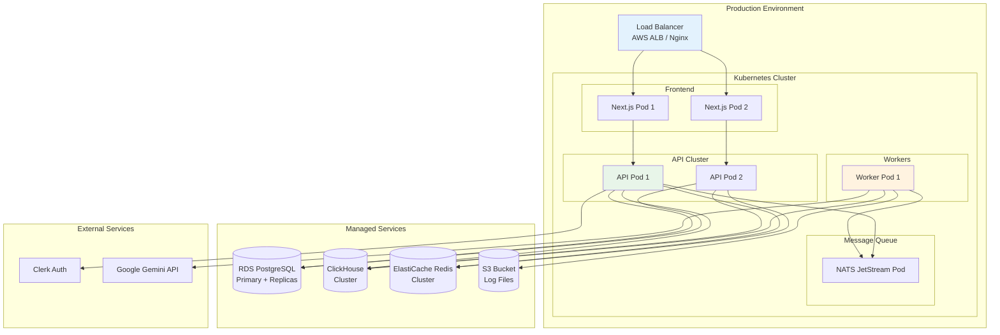

# RemedyIQ Architecture Diagrams

This directory contains architecture diagrams for the RemedyIQ platform.

## High-Level Architecture

```mermaid
graph TB
    subgraph "Client Layer"
        WEB[Web UI<br/>Next.js 16 + React 19]
    end
    
    subgraph "API Layer"
        API[REST API<br/>Go + Gorilla Mux]
        SSE[SSE Streaming<br/>AI Responses]
        WS[WebSocket<br/>Real-time Updates]
    end
    
    subgraph "Application Services"
        API_SRV[API Server<br/>cmd/api]
        WORKER[Worker Service<br/>cmd/worker]
    end
    
    subgraph "Message Queue"
        NATS[NATS JetStream<br/>Job Queue]
    end
    
    subgraph "AI & Analysis"
        JAR[ARLogAnalyzer.jar<br/>Log Parser]
        GEMINI[Google Gemini<br/>AI Analysis]
        BLEVE[Bleve<br/>Full-text Search]
    end
    
    subgraph "Storage Layer"
        PG[(PostgreSQL 16<br/>Metadata & Tenant)]
        CH[(ClickHouse 24<br/>Log Entries)]
        REDIS[(Redis 7<br/>Cache)]
        MINIO[(MinIO/S3<br/>Log Files)]
    end
    
    subgraph "External Services"
        CLERK[Clerk<br/>Authentication]
    end
    
    WEB -->|HTTP/SSE/WS| API
    WEB --> SSE
    WEB --> WS
    
    API --> API_SRV
    SSE --> API_SRV
    WS --> API_SRV
    
    API_SRV -->|SQL| PG
    API_SRV -->|CHQL| CH
    API_SRV -->|Get/Set| REDIS
    API_SRV -->|Upload/Download| MINIO
    API_SRV --> NATS
    API_SRV -->|JWT Validate| CLERK
    
    WORKER -->|Subscribe| NATS
    WORKER -->|Execute| JAR
    WORKER -->|Stream| GEMINI
    WORKER -->|Index| BLEVE
    WORKER -->|SQL| PG
    WORKER -->|CHQL| CH
    WORKER -->|Store| MINIO
    WORKER -->|Cache| REDIS
    
    NATS -->|Publish| WORKER
    
    style WEB fill:#e1f5ff
    style API fill:#fff4e1
    style API_SRV fill:#e8f5e9
    style WORKER fill:#e8f5e9
    style PG fill:#fce4ec
    style CH fill:#f3e5f5
    style REDIS fill:#fff3e0
    style MINIO fill:#e0f2f1
    style NATS fill:#f1f8e9
    style GEMINI fill:#ede7f6
```

## Data Flow - Log Upload & Analysis

```mermaid
sequenceDiagram
    participant User
    participant WebUI
    participant API as API Server
    participant NATS
    participant Worker
    participant JAR as ARLogAnalyzer.jar
    participant CH as ClickHouse
    participant PG as PostgreSQL
    participant S3 as MinIO/S3
    participant Redis
    
    User->>WebUI: Upload .log file (drag & drop)
    WebUI->>API: POST /api/v1/files/upload (multipart)
    API->>S3: Store raw log file
    API->>PG: Create LogFile record
    API->>PG: Create AnalysisJob (status: queued)
    API->>NATS: Publish job.created event
    API-->>WebUI: Return job_id with progress URL
    
    Worker->>NATS: Subscribe to job.* subjects
    NATS->>Worker: job.created message
    
    Worker->>PG: Update job status (parsing)
    Worker->>S3: Download file to temp
    Worker->>JAR: Execute with log file path
    JAR-->>Worker: Parsed JSON output
    
    Worker->>PG: Update job status (analyzing)
    Worker->>Worker: Parse JAR output
    Worker->>Worker: Detect anomalies
    Worker->>Redis: Cache dashboard sections
    
    Worker->>PG: Update job status (storing)
    Worker->>CH: Batch insert log entries
    Worker->>BLEVE: Build search index
    
    Worker->>PG: Update job status (complete)
    Worker->>NATS: Publish job.completed event
    API->>WebUI: WebSocket push (100% progress)
    
    WebUI->>API: GET /api/v1/analysis/:job_id/dashboard
    API-->>WebUI: Dashboard data
    WebUI->>User: Show dashboard with results
```

## Multi-Tenant Architecture

```mermaid
graph TB
    subgraph "Tenant Isolation Layer"
        AUTH[Clerk JWT<br/>Authentication]
        MW[Tenant Middleware<br/>Extract org_id]
        RLS[PostgreSQL RLS<br/>app.tenant_id]
    end
    
    subgraph "Request Flow"
        REQ[HTTP Request] --> AUTH
        AUTH -->|Validate JWT| MW
        MW -->|SET app.tenant_id| RLS
        RLS -->|Filtered Query| DB[(Database)]
    end
    
    subgraph "Tenant A"
        TA_DATA[Tenant A Data<br/>tenant_id = 'a']
        TA_S3[s3://tenant-a/]
        TA_NATS[jobs.tenant-a.*]
    end
    
    subgraph "Tenant B"
        TB_DATA[Tenant B Data<br/>tenant_id = 'b']
        TB_S3[s3://tenant-b/]
        TB_NATS[jobs.tenant-b.*]
    end
    
    RLS --> TA_DATA
    RLS --> TB_DATA
    
    style AUTH fill:#e3f2fd
    style MW fill:#fff3e0
    style RLS fill:#fce4ec
```

## AI Streaming Flow (SSE)

```mermaid
sequenceDiagram
    participant User
    participant WebUI
    participant API as API Server
    participant Router as AI Router
    participant Skill as AI Skill
    participant Gemini as Google Gemini
    participant CH as ClickHouse
    
    User->>WebUI: Ask: "Show me slow API calls"
    WebUI->>API: POST /api/v1/ai/stream (SSE)
    
    API->>Router: Route query
    Router->>Router: Match keywords/patterns
    Router-->>API: skill = "performance"
    
    API->>CH: Fetch context data
    CH-->>API: Top slow API calls
    
    API->>Gemini: StreamGenerateContent
    Note over API,Gemini: System prompt + context + query
    
    loop Streaming chunks
        Gemini-->>API: Chunk delta
        API-->>WebUI: SSE: data: {"delta": "..."}
        WebUI->>User: Render markdown incrementally
    end
    
    Gemini-->>API: Stream complete
    API->>PG: Store conversation message
    API-->>WebUI: SSE: data: [DONE]
```

## Real-time Dashboard Updates

```mermaid
graph TB
    subgraph "Browser"
        REACT[React App]
        WS_CLIENT[WebSocket Client]
        HOOKS[useJobProgress Hook]
    end
    
    subgraph "API Server"
        WS_HUB[WebSocket Hub]
        SUBS[Active Subscriptions]
    end
    
    subgraph "Worker"
        PROCESSOR[Job Processor]
        NATS_SUB[NATS Subscriber]
    end
    
    subgraph "NATS"
        JS[JetStream<br/>jobs.{tenant_id}.*]
    end
    
    REACT --> WS_CLIENT
    WS_CLIENT -->|Connect| WS_HUB
    WS_HUB --> SUBS
    
    PROCESSOR -->|Progress Update| NATS_SUB
    NATS_SUB -->|Publish| JS
    JS -->|Subscribe| WS_HUB
    WS_HUB -->|Broadcast| WS_CLIENT
    WS_CLIENT --> HOOKS
    HOOKS --> REACT
    
    style REACT fill:#61dafb
    style WS_HUB fill:#ff9800
    style JS fill:#4caf50
```

## Component Interaction - Request Processing

```mermaid
graph TB
    subgraph "HTTP Request"
        REQ[Incoming Request]
    end
    
    subgraph "Middleware Chain"
        RECOV[Recovery<br/>Panic Handler]
        LOG[Logging<br/>Request Logger]
        CORS[CORS<br/>Origin Check]
        LIMIT[Body Limit<br/>10MB Max]
        AUTH[Auth Middleware<br/>Clerk JWT]
        TENANT[Tenant Middleware<br/>org_id injection]
    end
    
    subgraph "Handler"
        HANDLER[Route Handler]
        VALIDATE[Input Validation]
        SERVICE[Business Logic]
    end
    
    subgraph "Response"
        RESP[JSON Response]
        ERR[Error Response]
    end
    
    REQ --> RECOV
    RECOV --> LOG
    LOG --> CORS
    CORS --> LIMIT
    LIMIT --> AUTH
    AUTH --> TENANT
    TENANT --> HANDLER
    HANDLER --> VALIDATE
    VALIDATE --> SERVICE
    SERVICE --> RESP
    SERVICE --> ERR
    
    style AUTH fill:#e3f2fd
    style TENANT fill:#fff3e0
```

## Technology Stack

| Layer | Technology | Version | Purpose |
|-------|-----------|---------|---------|
| **Frontend Framework** | Next.js | 16.x | App Router, SSR/SSG |
| **UI Library** | React | 19.x | Component framework |
| **Language (FE)** | TypeScript | 5.x | Type safety |
| **Styling** | Tailwind CSS | 4.x | Utility-first CSS |
| **UI Components** | shadcn/ui | Latest | Accessible components |
| **Charts** | Recharts | 2.x | Data visualization |
| **State Management** | Zustand | 5.x | Global state |
| **Data Fetching** | TanStack Query | 5.x | Server state |
| **Backend Language** | Go | 1.24 | High-performance services |
| **HTTP Router** | Gorilla Mux | 1.8 | URL routing |
| **Primary Database** | PostgreSQL | 16 | Metadata, multi-tenant |
| **Analytics Database** | ClickHouse | 24 | Time-series log data |
| **Message Queue** | NATS JetStream | 2.x | Job queue, events |
| **Cache** | Redis | 7 | Session, dashboard cache |
| **Object Storage** | MinIO | Latest | S3-compatible storage |
| **AI (Primary)** | Google Gemini | gemini-2.5-flash | Streaming AI |
| **Search Engine** | Bleve | 2.5 | Full-text search |
| **Authentication** | Clerk | 6.x | Multi-tenant auth |
| **Log Parser** | ARLogAnalyzer.jar | 3.2.2 | BMC Remedy log parsing |

## Deployment Architecture

```mermaid
graph TB
    subgraph "Production Environment"
        LB[Load Balancer<br/>AWS ALB / Nginx]
        
        subgraph "Kubernetes Cluster"
            subgraph "Frontend"
                FE1[Next.js Pod 1]
                FE2[Next.js Pod 2]
            end
            
            subgraph "API Cluster"
                API1[API Pod 1]
                API2[API Pod 2]
            end
            
            subgraph "Workers"
                WKR1[Worker Pod 1]
            end
            
            subgraph "Message Queue"
                NATS_POD[NATS JetStream Pod]
            end
        end
    end
    
    subgraph "Managed Services"
        PG_HA[(RDS PostgreSQL<br/>Primary + Replicas)]
        CH_CLUSTER[(ClickHouse<br/>Cluster)]
        REDIS_HA[(ElastiCache Redis<br/>Cluster)]
        S3_BUCKET[(S3 Bucket<br/>Log Files)]
    end
    
    subgraph "External Services"
        CLERK[Clerk Auth]
        GEMINI[Google Gemini API]
    end
    
    LB --> FE1
    LB --> FE2
    FE1 --> API1
    FE2 --> API2
    
    API1 --> PG_HA
    API2 --> PG_HA
    API1 --> CH_CLUSTER
    API2 --> CH_CLUSTER
    API1 --> REDIS_HA
    API2 --> REDIS_HA
    
    WKR1 --> S3_BUCKET
    WKR1 --> CH_CLUSTER
    WKR1 --> NATS_POD
    WKR1 --> GEMINI
    
    API1 --> NATS_POD
    API1 --> CLERK
    
    style LB fill:#e3f2fd
    style API1 fill:#e8f5e9
    style WKR1 fill:#fff3e0
```

## Security Architecture

```mermaid
graph TB
    subgraph "Client"
        BROWSER[Browser]
    end
    
    subgraph "Authentication Layer"
        CLERK_FE[Clerk Frontend<br/>Sign-in/Sign-up]
        CLERK_BK[Clerk Backend<br/>JWT Validation]
    end
    
    subgraph "Authorization Layer"
        MW_AUTH[Auth Middleware<br/>JWT Verify]
        MW_TENANT[Tenant Middleware<br/>org_id extraction]
    end
    
    subgraph "Data Isolation"
        RLS[PostgreSQL RLS<br/>Row-Level Security]
        S3_PREFIX[S3 Prefix<br/>tenant_id/]
        NATS_SUBJECT[NATS Subject<br/>jobs.{tenant_id}.*]
    end
    
    subgraph "Data Layer"
        PG[(PostgreSQL)]
        S3[(MinIO/S3)]
        NATS[(NATS)]
    end
    
    BROWSER --> CLERK_FE
    CLERK_FE -->|JWT Token| MW_AUTH
    MW_AUTH -->|Valid JWT| MW_TENANT
    MW_TENANT -->|SET app.tenant_id| RLS
    RLS -->|Filtered| PG
    MW_TENANT -->|Prefix| S3_PREFIX
    S3_PREFIX --> S3
    MW_TENANT -->|Subject| NATS_SUBJECT
    NATS_SUBJECT --> NATS
    
    style CLERK_FE fill:#e3f2fd
    style RLS fill:#fce4ec
```
