# Entity Relationship Diagram

This document shows the database schema relationships between PostgreSQL (metadata) and ClickHouse (log entries).

## Overview

RemedyIQ uses a polyglot persistence strategy:

- **PostgreSQL**: Stores metadata, tenant information, job status, and AI interactions
- **ClickHouse**: Stores high-volume log entries with time-series optimization

## Entity Relationship Diagram

```mermaid
erDiagram
    TENANT ||--o{ LOG_FILE : "owns"
    TENANT ||--o{ ANALYSIS_JOB : "creates"
    TENANT ||--o{ AI_INTERACTION : "performs"
    TENANT ||--o{ SAVED_SEARCH : "saves"
    TENANT ||--o{ CONVERSATION : "starts"
    
    LOG_FILE ||--o{ ANALYSIS_JOB : "analyzed_by"
    
    ANALYSIS_JOB ||--o{ AI_INTERACTION : "triggers"
    ANALYSIS_JOB ||--o{ CONVERSATION : "discussed_in"
    ANALYSIS_JOB ||--o{ LOG_ENTRY : "contains"
    
    CONVERSATION ||--o{ MESSAGE : "has"

    TENANT {
        uuid id PK
        string clerk_org_id UK
        string name
        string plan
        int storage_limit_gb
        timestamp created_at
        timestamp updated_at
    }
    
    LOG_FILE {
        uuid id PK
        uuid tenant_id FK
        string filename
        bigint size_bytes
        string s3_key
        string s3_bucket
        string content_type
        string[] detected_types
        string checksum_sha256
        timestamp uploaded_at
    }
    
    ANALYSIS_JOB {
        uuid id PK
        uuid tenant_id FK
        string status
        uuid file_id FK
        jsonb jar_flags
        int jvm_heap_mb
        int timeout_seconds
        int progress_pct
        bigint total_lines
        bigint processed_lines
        bigint api_count
        bigint sql_count
        bigint filter_count
        bigint esc_count
        timestamp start_time
        timestamp end_time
        timestamp log_start
        timestamp log_end
        string log_duration
        string error_message
        string jar_stderr
        timestamp created_at
        timestamp updated_at
        timestamp completed_at
    }
    
    AI_INTERACTION {
        uuid id PK
        uuid tenant_id FK
        uuid job_id FK
        string user_id
        string skill_name
        text input_text
        text output_text
        jsonb referenced_lines
        int tokens_used
        int latency_ms
        string status
        timestamp created_at
    }
    
    SAVED_SEARCH {
        uuid id PK
        uuid tenant_id FK
        string user_id
        string name
        text kql_query
        jsonb filters
        boolean is_pinned
        timestamp created_at
    }
    
    CONVERSATION {
        uuid id PK
        uuid tenant_id FK
        string user_id
        uuid job_id FK
        string title
        timestamp created_at
        timestamp updated_at
        int message_count
        timestamp last_message_at
        jsonb metadata
    }
    
    MESSAGE {
        uuid id PK
        uuid conversation_id FK
        uuid tenant_id FK
        string role
        text content
        string skill_name
        string[] follow_ups
        int tokens_used
        int latency_ms
        string status
        string error_message
        timestamp created_at
    }
    
    LOG_ENTRY {
        string tenant_id
        string job_id FK
        string entry_id PK
        uint32 line_number
        uint16 file_number
        datetime64 timestamp
        datetime64 ingested_at
        enum log_type
        string trace_id
        string rpc_id
        string thread_id
        string queue
        string user
        uint32 duration_ms
        uint32 queue_time_ms
        bool success
        string api_code
        string form
        string sql_table
        string sql_statement
        string filter_name
        uint8 filter_level
        string operation
        string request_id
        string esc_name
        string esc_pool
        datetime64 scheduled_time
        uint32 delay_ms
        bool error_encountered
        string raw_text
        string error_message
    }
```



## Table Details

### PostgreSQL Tables

#### tenants
Primary entity for multi-tenant isolation. Each organization is a tenant.

| Column | Type | Description |
|--------|------|-------------|
| id | UUID | Primary key |
| clerk_org_id | TEXT | Clerk organization ID (unique) |
| name | TEXT | Organization name |
| plan | TEXT | Subscription plan (free/pro/enterprise) |
| storage_limit_gb | INTEGER | Storage quota |
| created_at | TIMESTAMPTZ | Creation timestamp |
| updated_at | TIMESTAMPTZ | Last update timestamp |

#### log_files
Metadata for uploaded log files.

| Column | Type | Description |
|--------|------|-------------|
| id | UUID | Primary key |
| tenant_id | UUID | Foreign key to tenants |
| filename | TEXT | Original filename |
| size_bytes | BIGINT | File size |
| s3_key | TEXT | S3 object key |
| s3_bucket | TEXT | S3 bucket name |
| content_type | TEXT | MIME type |
| detected_types | TEXT[] | Detected log types |
| checksum_sha256 | TEXT | SHA256 hash |
| uploaded_at | TIMESTAMPTZ | Upload timestamp |

#### analysis_jobs
Tracks the lifecycle of log analysis jobs.

| Column | Type | Description |
|--------|------|-------------|
| id | UUID | Primary key |
| tenant_id | UUID | Foreign key to tenants |
| status | TEXT | Job status (queued/parsing/analyzing/storing/complete/failed) |
| file_id | UUID | Foreign key to log_files |
| jar_flags | JSONB | ARLogAnalyzer.jar configuration |
| jvm_heap_mb | INTEGER | JVM heap size |
| timeout_seconds | INTEGER | Job timeout |
| progress_pct | INTEGER | Progress percentage (0-100) |
| total_lines | BIGINT | Total log lines |
| api_count | BIGINT | API log count |
| sql_count | BIGINT | SQL log count |
| filter_count | BIGINT | Filter log count |
| esc_count | BIGINT | Escalation log count |
| error_message | TEXT | Error message if failed |
| created_at | TIMESTAMPTZ | Creation timestamp |
| completed_at | TIMESTAMPTZ | Completion timestamp |

#### conversations & messages
AI conversation threads and individual messages.

| Column | Type | Description |
|--------|------|-------------|
| id | UUID | Primary key |
| tenant_id | UUID | Foreign key to tenants |
| job_id | UUID | Associated analysis job |
| title | TEXT | Conversation title |
| message_count | INT | Number of messages |

### ClickHouse Tables

#### log_entries
High-volume log entry storage with time-series optimization.

| Column | Type | Description |
|--------|------|-------------|
| tenant_id | String | Tenant identifier |
| job_id | String | Analysis job ID |
| entry_id | String | Unique entry ID (default: UUID) |
| line_number | UInt32 | Line number in original file |
| file_number | UInt16 | File number (for multi-file logs) |
| timestamp | DateTime64(3) | Log entry timestamp |
| ingested_at | DateTime64(3) | Ingestion timestamp |
| log_type | Enum8 | Log type (API/SQL/FLTR/ESCL) |
| trace_id | String | Transaction trace ID |
| rpc_id | String | RPC ID within trace |
| thread_id | String | Server thread ID |
| queue | String | Server queue name |
| user | String | AR System user |
| duration_ms | UInt32 | Operation duration |
| queue_time_ms | UInt32 | Queue wait time |
| success | Bool | Operation success flag |
| raw_text | String | Original log line |

**Engine**: MergeTree
**Partition**: (tenant_id, toYYYYMM(timestamp))
**Order**: (tenant_id, job_id, log_type, timestamp, line_number)
**TTL**: 90 days

#### log_entries_aggregates (Materialized View)
Pre-computed aggregations for dashboard queries.

| Column | Type | Description |
|--------|------|-------------|
| tenant_id | String | Tenant identifier |
| job_id | String | Analysis job ID |
| log_type | Enum8 | Log type |
| period_start | DateTime | 1-minute bucket |
| entry_count | AggregateFunction(count) | Entry count state |
| success_count | AggregateFunction(countIf) | Success count state |
| failure_count | AggregateFunction(countIf) | Failure count state |
| avg_duration_ms | AggregateFunction(avg) | Avg duration state |
| max_duration_ms | AggregateFunction(max) | Max duration state |
| min_duration_ms | AggregateFunction(min) | Min duration state |
| sum_duration_ms | AggregateFunction(sum) | Sum duration state |
| unique_users | AggregateFunction(uniqExact) | Unique user count state |
| unique_forms | AggregateFunction(uniqExact) | Unique form count state |
| unique_tables | AggregateFunction(uniqExact) | Unique table count state |

**Engine**: AggregatingMergeTree
**Partition**: (tenant_id, toYYYYMM(period_start))
**Order**: (tenant_id, job_id, log_type, period_start)

## Row-Level Security (RLS)

All PostgreSQL tables use RLS policies for tenant isolation:

```sql
CREATE POLICY tenant_isolation ON {table}
    USING (tenant_id::TEXT = current_setting('app.tenant_id', true))
    WITH CHECK (tenant_id::TEXT = current_setting('app.tenant_id', true));
```

The `app.tenant_id` session variable is set by the tenant middleware after JWT validation.
