# Worker Pipeline

This document describes the job processing pipeline in the Worker service.

## Pipeline Overview

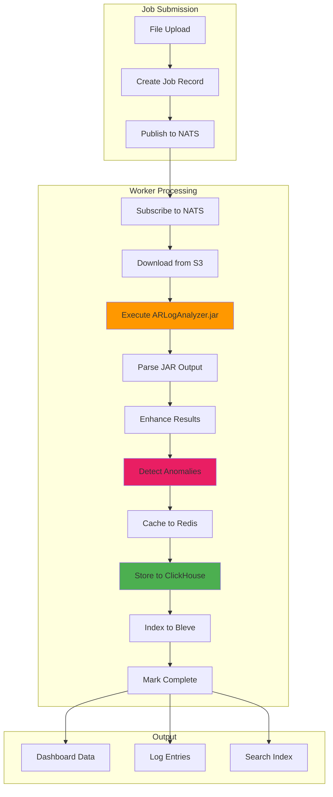

## Job Status Lifecycle

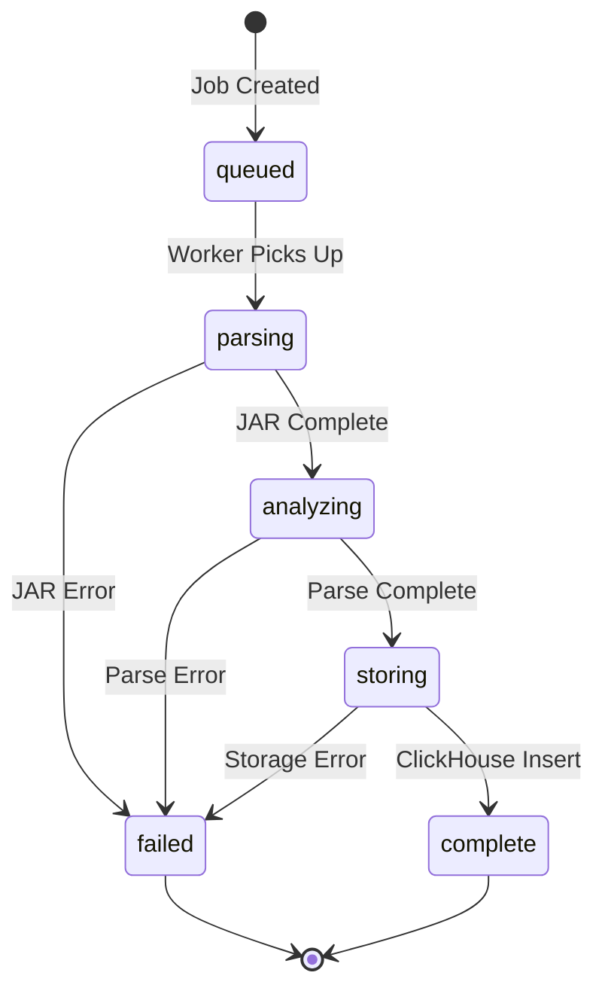

## Pipeline Stages

### Stage 1: Job Pickup

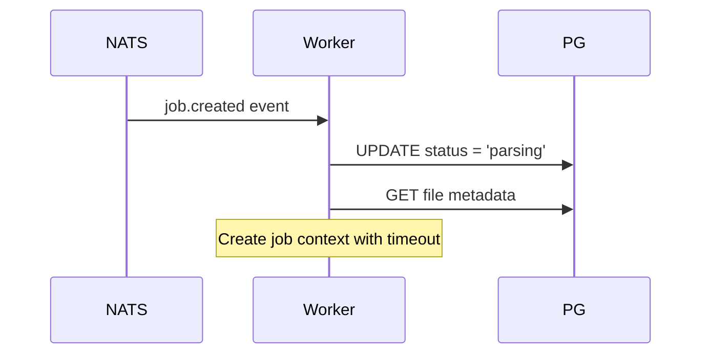

**Key Actions:**
1. Subscribe to `jobs.{tenant_id}.*` subjects
2. Update job status to `parsing`
3. Fetch file metadata from PostgreSQL
4. Create per-job context with 30-minute timeout

### Stage 2: File Download

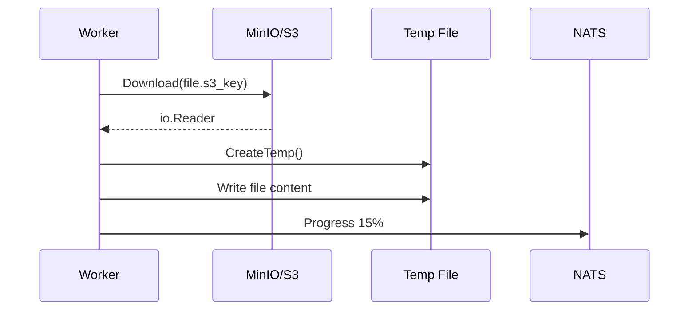

**Key Actions:**
1. Stream download from S3
2. Write to temp file (auto-cleanup on exit)
3. Publish progress update

### Stage 3: JAR Execution

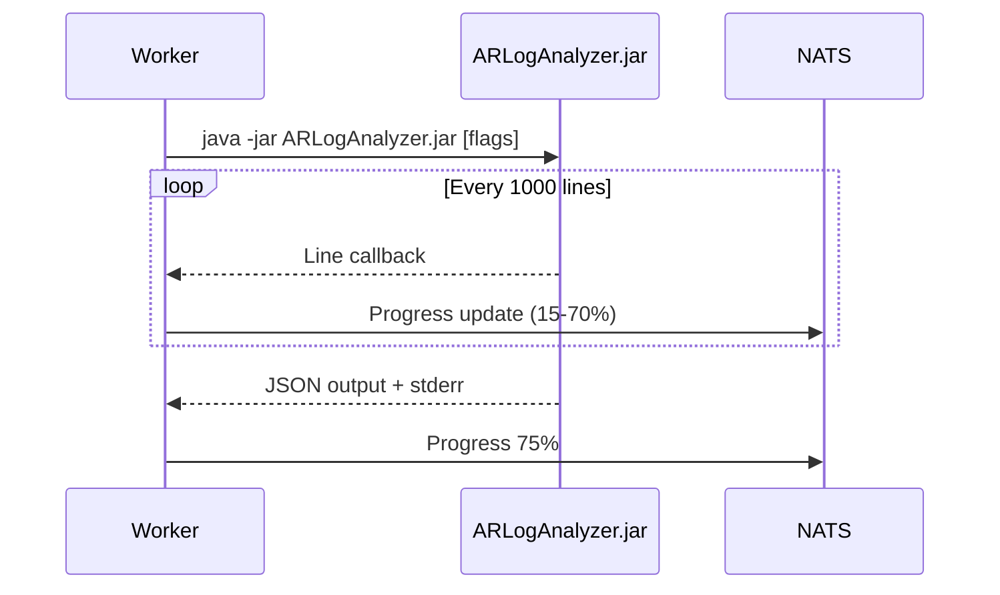

**Key Actions:**
1. Execute JAR with configured flags and heap size
2. Stream stdout to parser
3. Capture stderr for error reporting
4. Report progress based on lines processed

**JAR Flags:**
- `--top-n`: Number of top entries to include
- `--group-by`: Aggregation dimensions
- `--skip-api`, `--skip-sql`, `--skip-fltr`, `--skip-esc`: Skip log types
- `--begin-time`, `--end-time`: Time range filter
- `--user-filter`: Filter by user

### Stage 4: Parse & Enhance

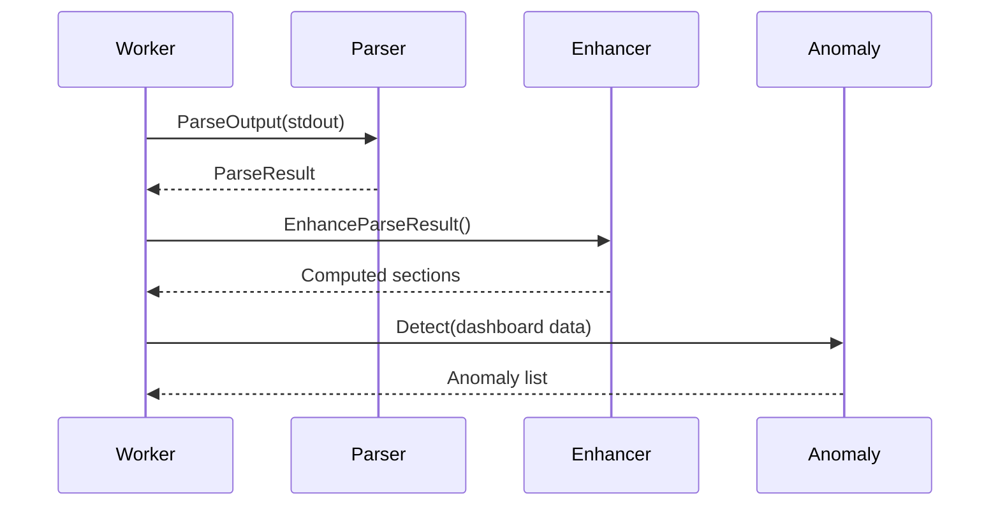

**Key Actions:**
1. Parse JAR JSON output into structured data
2. Compute derived sections (time series, distribution)
3. Run anomaly detection on top-N data
4. Generate health score

### Stage 5: Cache Results

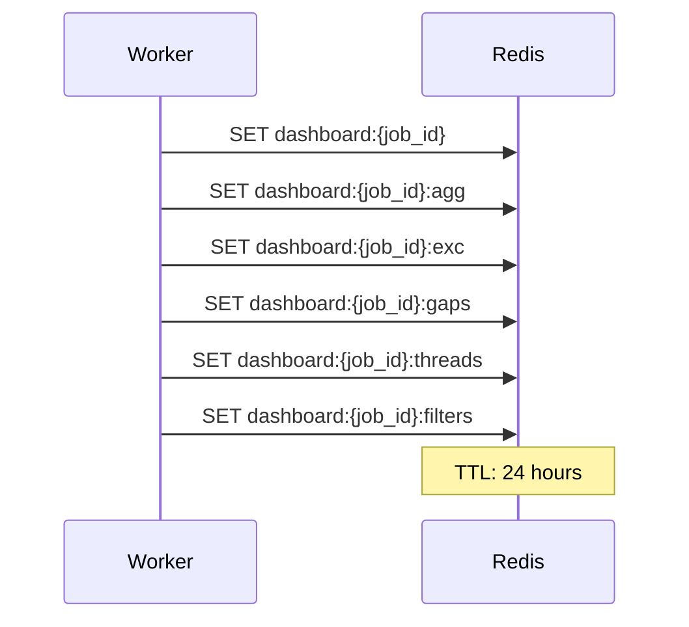

**Cached Sections:**
- `dashboard:{job_id}` - Full dashboard data
- `dashboard:{job_id}:agg` - Aggregates (by form, client, table)
- `dashboard:{job_id}:exc` - Exceptions and errors
- `dashboard:{job_id}:gaps` - Idle periods and queue health
- `dashboard:{job_id}:threads` - Thread statistics
- `dashboard:{job_id}:filters` - Filter complexity data
- `dashboard:{job_id}:queued` - Queued API calls
- `dashboard:{job_id}:logging-activity` - Logging duration per type
- `dashboard:{job_id}:file-metadata` - Per-file metadata

### Stage 6: Store to ClickHouse

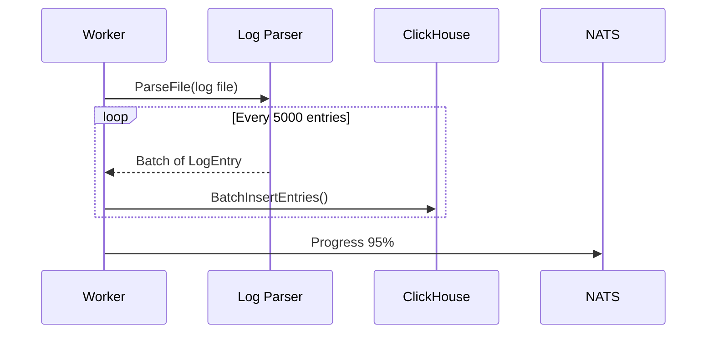

**Key Actions:**
1. Parse raw log file into LogEntry structs
2. Batch insert into ClickHouse (5000 entries per batch)
3. ClickHouse automatically updates materialized views

### Stage 7: Build Search Index

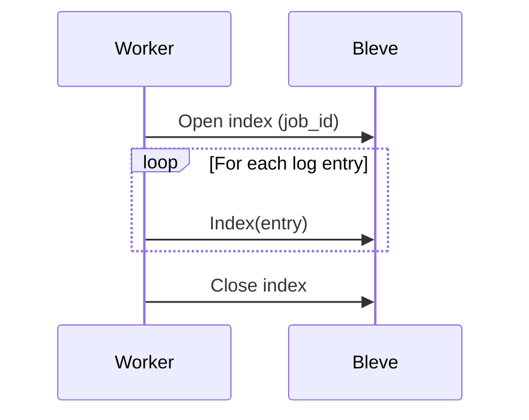

**Indexed Fields:**
- `trace_id` - Exact match
- `user` - Exact match
- `form` - Exact match
- `operation` - Exact match
- `raw_text` - Full-text search
- `timestamp` - Range queries

### Stage 8: Complete Job

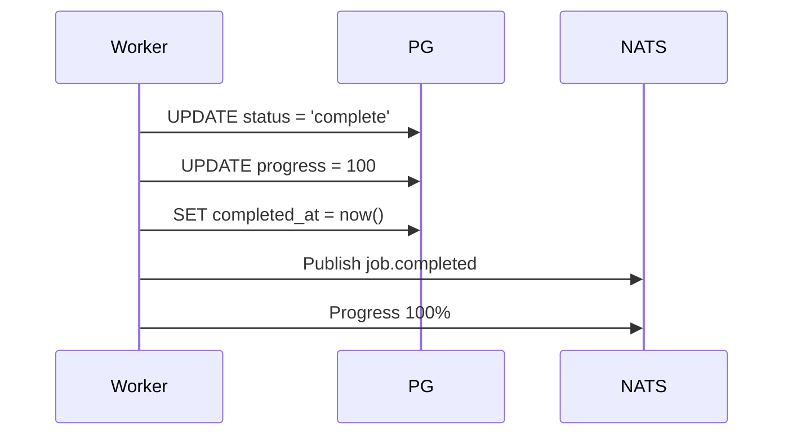

## Error Handling

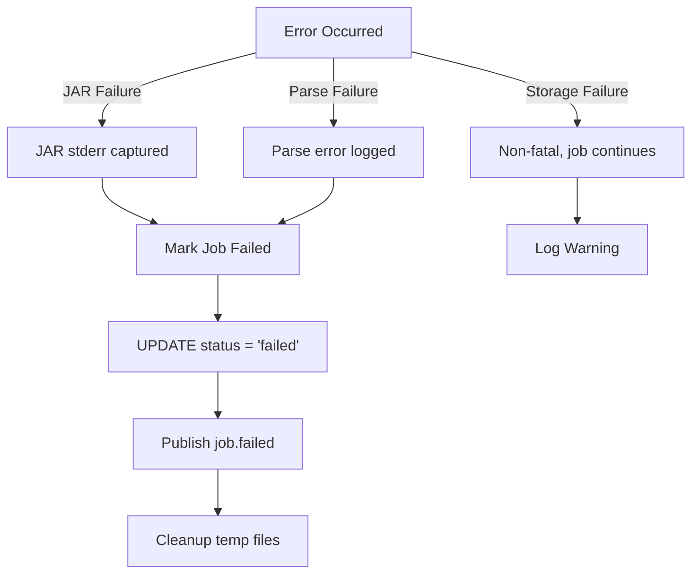

## Progress Reporting

| Stage | Progress Range | Description |
|-------|---------------|-------------|
| Download | 0-15% | File download from S3 |
| JAR Execution | 15-70% | Based on lines processed |
| Parse | 70-75% | Parse JAR output |
| Cache | 75-85% | Store to Redis |
| ClickHouse | 85-95% | Batch insert entries |
| Index | 95-99% | Build Bleve index |
| Complete | 100% | Job finished |

## Anomaly Detection

The pipeline runs anomaly detection on:
- **Slow API calls**: Z-score outlier detection on duration
- **Slow SQL statements**: Z-score outlier detection on duration
- **High filter execution**: Statistical deviation from mean

Detected anomalies are logged and can trigger alerts.

## Scaling Considerations

### Current Constraint

The worker is intentionally deployed as a **single replica**:
- Bleve index requires single-writer access
- PVC uses `ReadWriteOnce` access mode
- Multiple workers would cause index corruption

### Future Scaling Path

To enable horizontal scaling:
1. Replace Bleve with distributed search (Elasticsearch, Meilisearch)
2. Use shared storage with proper locking
3. Implement index sharding with coordinator
