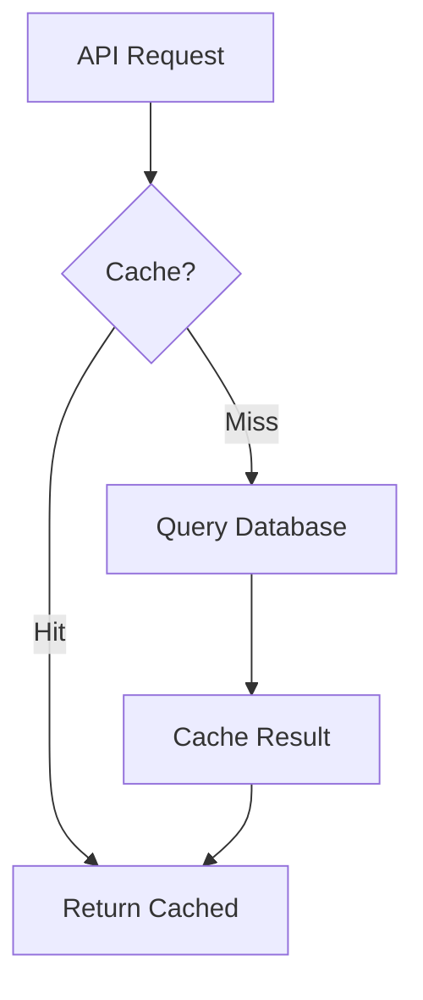

# Databases

This document describes the database configuration for RemedyIQ.

## PostgreSQL

### Purpose

PostgreSQL stores:
- Tenant metadata
- Log file metadata
- Analysis job status
- AI interactions and conversations
- Saved searches

### Configuration

**Local Development:**
```
Host: localhost
Port: 5432
Database: remedyiq
User: remedyiq
Password: remedyiq
```

**Production:**
- Use AWS RDS PostgreSQL 16
- Multi-AZ deployment
- Automated backups

### Schema Management

Migrations are stored in `backend/migrations/`:

```bash
# Apply migrations
make migrate-up

# Rollback
make migrate-down

# Create new migration
migrate create -ext sql -dir backend/migrations -seq migration_name
```

### Row-Level Security

All tenant-scoped tables have RLS enabled:

```sql
ALTER TABLE {table} ENABLE ROW LEVEL SECURITY;

CREATE POLICY tenant_isolation ON {table}
    USING (tenant_id::TEXT = current_setting('app.tenant_id', true))
    WITH CHECK (tenant_id::TEXT = current_setting('app.tenant_id', true));
```

### Connection Pooling

```go
config := pgxpool.Config{
    ConnConfig: connConfig,
    MaxConns:    25,
    MinConns:    5,
    MaxConnLifetime: time.Hour,
    MaxConnIdleTime: 30 * time.Minute,
}
```

### Performance

| Metric | Value |
|--------|-------|
| Max connections | 25 |
| Connection lifetime | 1 hour |
| Idle timeout | 30 min |

---

## ClickHouse

### Purpose

ClickHouse stores:
- Parsed log entries (high volume)
- Pre-computed aggregates (materialized views)

### Configuration

**Local Development:**
```
Host: localhost
Port: 9000 (HTTP), 8123 (Native)
Database: remedyiq
```

**Production:**
- ClickHouse cluster with replicas
- S3 storage for cold data
- ZooKeeper for coordination

### Schema Management

```bash
# Initialize
clickhouse-client < backend/migrations/clickhouse/001_init.sql
```

### Table Engine

```sql
ENGINE = MergeTree()
PARTITION BY (tenant_id, toYYYYMM(timestamp))
ORDER BY (tenant_id, job_id, log_type, timestamp, line_number)
TTL toDateTime(timestamp) + INTERVAL 90 DAY DELETE
```

### Batch Insert

Entries are inserted in batches of 5000:

```go
batch, _ := conn.PrepareBatch(ctx, "INSERT INTO log_entries ...")
for _, entry := range entries {
    batch.Append(entry.TenantID, entry.JobID, ...)
}
batch.Send()
```

### Data Retention

- **TTL**: 90 days
- **Partitioning**: Monthly per tenant
- **Automatic cleanup**: Old partitions are dropped

---

## Redis

### Purpose

Redis stores:
- Dashboard data cache (24h TTL)
- Session data
- Real-time statistics
- Rate limiting counters

### Configuration

**Local Development:**
```
Host: localhost
Port: 6379
DB: 0
```

**Production:**
- AWS ElastiCache Redis 7
- Cluster mode enabled
- Multi-AZ

### Key Patterns

| Pattern | TTL | Purpose |
|---------|-----|---------|
| `{tenant}:dashboard:{job_id}` | 24h | Full dashboard |
| `{tenant}:dashboard:{job_id}:agg` | 24h | Aggregates |
| `{tenant}:dashboard:{job_id}:exc` | 24h | Exceptions |
| `{tenant}:search:{hash}` | 1h | Search results |

### Cache Strategy



### Invalidation

- Job completion invalidates all job-related cache
- Manual invalidation via API
- TTL-based expiration

---

## Connection Management

### Go Clients

```go
// PostgreSQL
import "github.com/jackc/pgx/v5/pgxpool"

// ClickHouse
import "github.com/ClickHouse/clickhouse-go/v2"

// Redis
import "github.com/redis/go-redis/v9"
```

### Health Checks

```go
// PostgreSQL
func (c *Client) Ping(ctx context.Context) error {
    return c.pool.Ping(ctx)
}

// ClickHouse
func (c *Client) Ping(ctx context.Context) error {
    return c.conn.Ping(ctx)
}

// Redis
func (c *Client) Ping(ctx context.Context) error {
    return c.client.Ping(ctx).Err()
}
```

---

## Production Considerations

### Backup Strategy

| Database | Method | Frequency |
|----------|--------|-----------|
| PostgreSQL | RDS snapshots | Hourly |
| ClickHouse | S3 backup | Daily |
| Redis | Not required | - |

### Monitoring

- Connection pool metrics
- Query latency (p50, p95, p99)
- Error rates
- Cache hit ratios

### Scaling

| Database | Horizontal | Vertical |
|----------|------------|----------|
| PostgreSQL | Read replicas | Instance size |
| ClickHouse | Sharding | Instance size |
| Redis | Cluster mode | Instance size |
