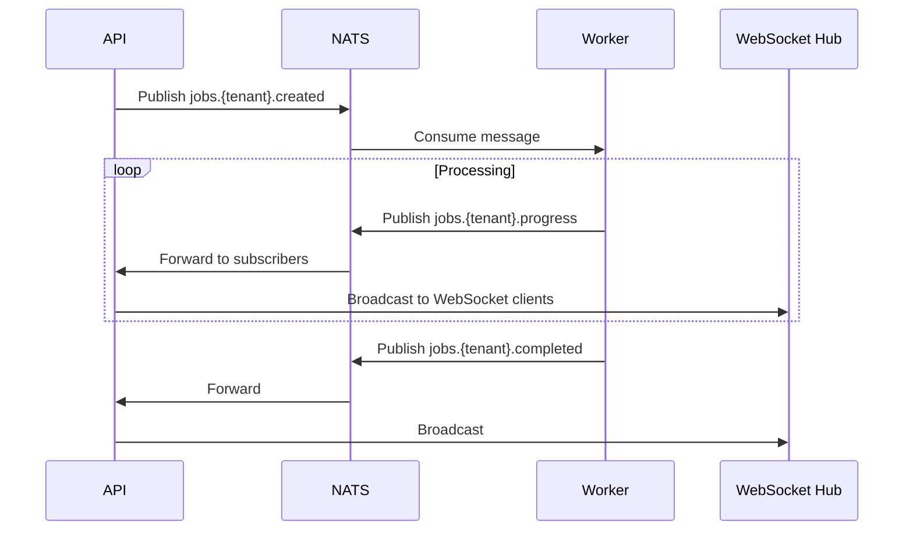

# NATS JetStream

This document describes the NATS JetStream configuration for RemedyIQ.

## Purpose

NATS JetStream provides:
- Job queue for worker coordination
- Event streaming for real-time updates
- Pub/sub for WebSocket broadcasting

## Configuration

**Local Development:**
```
Host: localhost
Port: 4222
Monitor: 8222
```

**Production:**
- Kubernetes deployment
- JetStream enabled
- File storage for persistence

## Subject Hierarchy

```
jobs.{tenant_id}.created     - Job created event
jobs.{tenant_id}.progress    - Progress updates
jobs.{tenant_id}.completed   - Job completion
jobs.{tenant_id}.failed      - Job failure
```

## Stream Configuration

```yaml
stream:
  name: JOBS
  subjects: "jobs.*.*"
  retention: limits
  max_msgs: 10000
  max_age: 24h
  storage: file
  replicas: 1
```

## Message Flow



## Client Implementation

### Publishing

```go
func (n *NATSClient) PublishJobSubmit(ctx context.Context, tenantID string, job domain.AnalysisJob) error {
    subject := fmt.Sprintf("jobs.%s.created", tenantID)
    data, _ := json.Marshal(job)
    return n.js.Publish(ctx, subject, data)
}

func (n *NATSClient) PublishJobProgress(ctx context.Context, tenantID, jobID string, pct int, status, message string) error {
    subject := fmt.Sprintf("jobs.%s.progress", tenantID)
    data, _ := json.Marshal(ProgressEvent{
        JobID:   jobID,
        Pct:     pct,
        Status:  status,
        Message: message,
    })
    return n.js.Publish(ctx, subject, data)
}
```

### Subscribing

```go
func (n *NATSClient) SubscribeJobSubmit(ctx context.Context, tenantID string, handler func(domain.AnalysisJob)) error {
    subject := fmt.Sprintf("jobs.%s.created", tenantID)
    _, err := n.js.Subscribe(subject, func(msg *nats.Msg) {
        var job domain.AnalysisJob
        json.Unmarshal(msg.Data, &job)
        handler(job)
    }, nats.Durable("worker-"+tenantID))
    return err
}
```

## Error Handling

- Messages are redelivered on failure
- Dead letter queue for failed messages
- Acknowledgment required after processing

## Monitoring

| Metric | Description |
|--------|-------------|
| `nats_stream_messages` | Total messages in stream |
| `nats_consumer_pending` | Pending messages per consumer |
| `nats_consumer_delivered` | Delivered messages |

## Production Configuration

```yaml
apiVersion: apps/v1
kind: Deployment
metadata:
  name: nats
spec:
  template:
    spec:
      containers:
        - name: nats
          image: nats:2.10-alpine
          args:
            - "--jetstream"
            - "--store_dir=/data"
            - "-m"
            - "8222"
          ports:
            - containerPort: 4222
            - containerPort: 8222
          volumeMounts:
            - name: data
              mountPath: /data
      volumes:
        - name: data
          persistentVolumeClaim:
            claimName: nats-pvc
```
