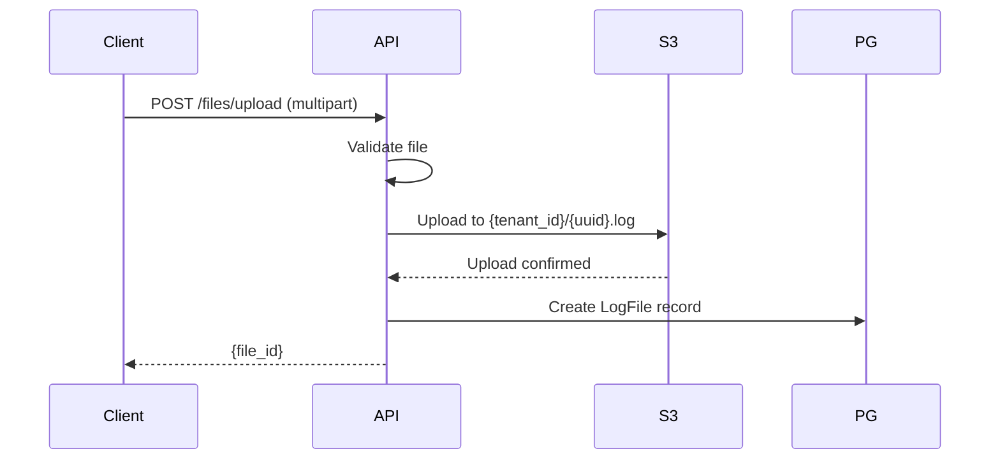

# Object Storage

This document describes the MinIO/S3 configuration for RemedyIQ.

## Purpose

Object storage is used for:
- Uploaded log files
- Generated reports
- Export files

## Configuration

### Local Development (MinIO)

```
Endpoint: http://localhost:9002
Console: http://localhost:9001
Access Key: minioadmin
Secret Key: minioadmin
Bucket: remedyiq
```

Start MinIO:
```bash
make docker-up
```

### Production (S3)

```
Provider: AWS S3
Region: us-east-1
Bucket: remedyiq-{env}
Encryption: SSE-S3
```

## Bucket Structure

```
remedyiq/
├── {tenant_id}/
│   ├── {file_id}.log
│   ├── {file_id}.log
│   └── ...
├── reports/
│   └── {job_id}/
│       └── report.html
└── exports/
    └── {job_id}/
        └── export.csv
```

## Client Implementation

### Upload

```go
func (s *S3Client) Upload(ctx context.Context, key string, reader io.Reader) error {
    _, err := s.client.PutObject(ctx, &s3.PutObjectInput{
        Bucket: aws.String(s.bucket),
        Key:    aws.String(key),
        Body:   reader,
    })
    return err
}
```

### Download

```go
func (s *S3Client) Download(ctx context.Context, key string) (io.ReadCloser, error) {
    result, err := s.client.GetObject(ctx, &s3.GetObjectInput{
        Bucket: aws.String(s.bucket),
        Key:    aws.String(key),
    })
    if err != nil {
        return nil, err
    }
    return result.Body, nil
}
```

### Delete

```go
func (s *S3Client) Delete(ctx context.Context, key string) error {
    _, err := s.client.DeleteObject(ctx, &s3.DeleteObjectInput{
        Bucket: aws.String(s.bucket),
        Key:    aws.String(key),
    })
    return err
}
```

## File Upload Flow



## Presigned URLs

For large file uploads, use presigned URLs:

```go
func (s *S3Client) GetPresignedUploadURL(ctx context.Context, key string, expiry time.Duration) (string, error) {
    req, _ := s.client.PutObjectRequest(&s3.PutObjectInput{
        Bucket: aws.String(s.bucket),
        Key:    aws.String(key),
    })
    return req.Presign(expiry)
}
```

## Security

### IAM Policy (Production)

```json
{
  "Version": "2012-10-17",
  "Statement": [
    {
      "Effect": "Allow",
      "Action": [
        "s3:PutObject",
        "s3:GetObject",
        "s3:DeleteObject"
      ],
      "Resource": "arn:aws:s3:::remedyiq-prod/*"
    }
  ]
}
```

### Encryption

- **At rest**: SSE-S3 (AWS-managed keys)
- **In transit**: TLS

## Lifecycle Policies

```json
{
  "Rules": [
    {
      "ID": "DeleteOldFiles",
      "Status": "Enabled",
      "Expiration": {
        "Days": 90
      }
    }
  ]
}
```

## Monitoring

| Metric | Description |
|--------|-------------|
| `s3_bucket_size_bytes` | Total bucket size |
| `s3_number_of_objects` | Object count |
| `s3_request_count` | API request count |

## Cost Optimization

- Use S3 Intelligent-Tiering for long-term storage
- Delete files after retention period
- Compress files before upload (optional)
