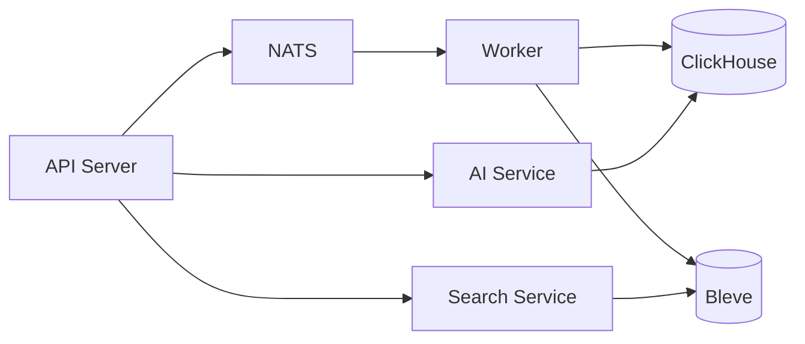

# Services Documentation

This section documents the internal services of RemedyIQ.

## Overview

RemedyIQ consists of several interconnected services:

| Service | Type | Purpose |
|---------|------|---------|
| API Server | HTTP | REST API, SSE, WebSocket |
| Worker | Background | Job processing, indexing |
| AI Service | Internal | Skill routing, Gemini integration |
| Search Service | Internal | KQL parsing, Bleve indexing |
| Trace Service | Internal | Trace building, critical path |

## Documentation

- [API Server](./api-server.md) - HTTP server internals
- [Worker Service](./worker-service.md) - Job pipeline
- [AI Service](./ai-service.md) - Skills and routing
- [Search Service](./search-service.md) - KQL and full-text search

## Service Communication

## Health Checks

| Service | Endpoint | Response |
|---------|----------|----------|
| API Server | `/api/v1/health` | `{status: ok}` |
| Worker | Metrics port | Prometheus metrics |
