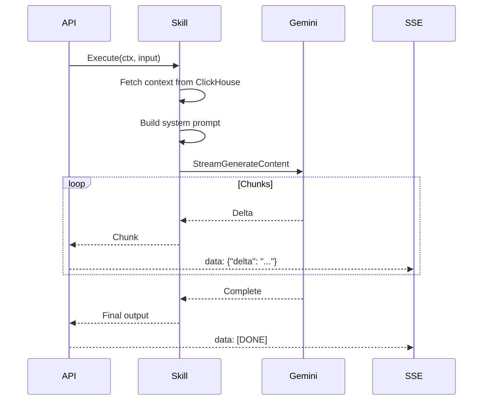

# AI Service

This document describes the AI service internals.

## Components

### Registry

**File:** `backend/internal/ai/registry.go`

Manages registered AI skills.

```go
type Registry struct {
    skills map[string]Skill
    mu     sync.RWMutex
}

func (r *Registry) Register(skill Skill) error
func (r *Registry) Get(name string) (Skill, error)
func (r *Registry) List() []SkillInfo
```

### Router

**File:** `backend/internal/ai/router.go`

Routes queries to appropriate skills.

```go
type Router struct {
    rules    []RoutingRule
    fallback string
}

type RoutingRule struct {
    SkillName string
    Keywords  []string
    Patterns  []*regexp.Regexp
}

func (r *Router) Route(query string) string
```

### Gemini Client

**File:** `backend/internal/ai/gemini_client.go`

Integrates with Google Gemini API.

```go
type GeminiClient struct {
    client    *genai.Client
    model     string
    maxTokens int
}

func (c *GeminiClient) Stream(ctx context.Context, systemPrompt, userQuery string) (<-chan string, error)
```

## Skill Interface

```go
type Skill interface {
    Name() string
    Description() string
    Execute(ctx context.Context, input SkillInput) (*SkillOutput, error)
    Examples() []string
}

type SkillInput struct {
    Query    string
    JobID    string
    TenantID string
    Context  map[string]interface{}
}

type SkillOutput struct {
    Answer     string
    References []LogReference
    FollowUps  []string
    Confidence float64
    SkillName  string
    TokensUsed int
    LatencyMS  int
}
```

## Skills

### Performance Skill

**File:** `backend/internal/ai/skills/performance.go`

**Keywords:** slow, latency, duration, timeout, bottleneck

**Context:** Fetches slow API/SQL operations from ClickHouse

**Example Query:** "Show me the slowest API calls"

### Root Cause Skill

**File:** `backend/internal/ai/skills/root_cause.go`

**Keywords:** root cause, correlat, why, cascading

**Context:** Fetches error correlations and timing data

**Example Query:** "Why did the system slow down at 3pm?"

### Error Explainer Skill

**File:** `backend/internal/ai/skills/error_explainer.go`

**Keywords:** error, arerr, exception, failed

**Context:** Fetches error entries with messages

**Example Query:** "What does ARERR 45055 mean?"

### Anomaly Narrator Skill

**File:** `backend/internal/ai/skills/anomaly.go`

**Keywords:** anomaly, unusual, unexpected, outlier

**Context:** Fetches statistical outliers

**Example Query:** "Are there any unusual patterns?"

### Summarizer Skill

**File:** `backend/internal/ai/skills/summarizer.go`

**Keywords:** summar, overview, executive, brief

**Context:** Fetches general statistics

**Example Query:** "Give me an executive summary"

### NL Query Skill

**File:** `backend/internal/ai/skills/nl_query.go`

**Keywords:** (fallback - no keywords)

**Context:** General dashboard data

**Example Query:** "How many users were active?"

## Streaming Flow



## Configuration

| Variable | Default | Description |
|----------|---------|-------------|
| GEMINI_API_KEY | - | Google Gemini API key |
| GEMINI_MODEL | gemini-2.5-flash | Model to use |
| AI_MAX_TOKENS | 4096 | Max response tokens |
