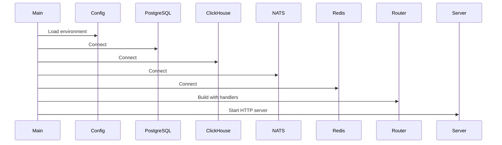
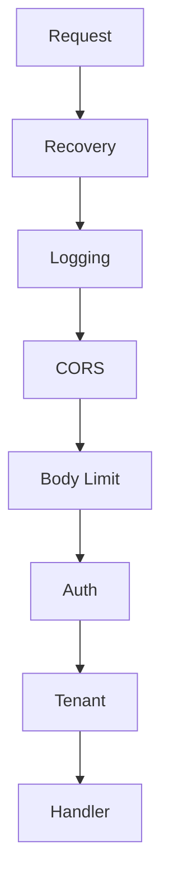
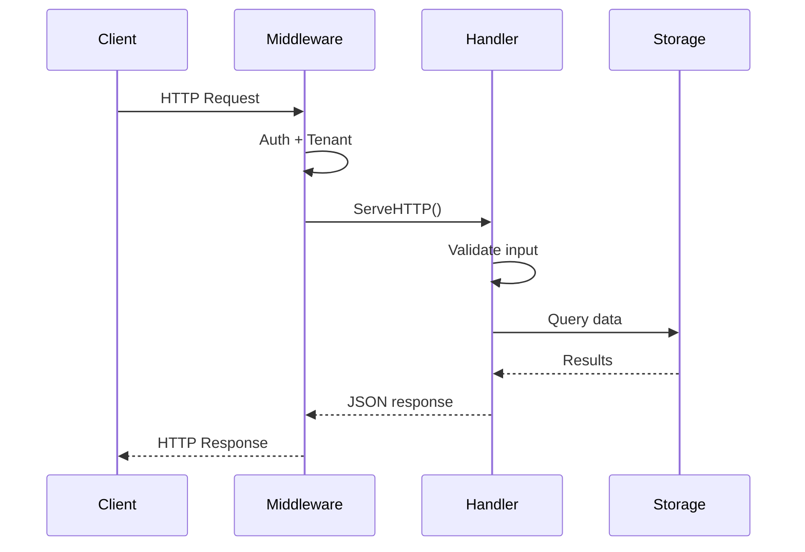

# API Server

This document describes the API server internals.

## Entry Point

**File:** `backend/cmd/api/main.go`

## Startup Sequence



## Handler Organization

Handlers are organized by domain:

```
backend/internal/api/handlers/
├── files.go          # File upload/list
├── analysis.go       # Job CRUD
├── dashboard.go      # Dashboard data
├── aggregates.go     # Aggregations
├── exceptions.go     # Errors
├── gaps.go           # Idle periods
├── threads.go        # Thread stats
├── filters.go        # Filter complexity
├── search.go         # KQL search
├── trace.go          # Trace data
├── ai.go             # AI queries
├── ai_stream.go      # SSE streaming
├── conversations.go  # Chat threads
├── upload.go         # Multipart upload
├── stream.go         # WebSocket
└── health.go         # Health check
```

## Middleware Chain



| Middleware | File | Purpose |
|------------|------|---------|
| Recovery | `recovery.go` | Panic recovery |
| Logging | `logging.go` | Request logging |
| CORS | `cors.go` | Cross-origin headers |
| Body Limit | `body_limit.go` | 10MB limit |
| Auth | `auth.go` | JWT validation |
| Tenant | `tenant.go` | org_id extraction |

## Dependency Injection

Handlers receive dependencies via constructor functions:

```go
type UploadHandler struct {
    pg    storage.PostgresStore
    s3    storage.S3Storage
    nats  streaming.NATSStreamer
}

func NewUploadHandler(pg storage.PostgresStore, s3 storage.S3Storage, nats streaming.NATSStreamer) *UploadHandler {
    return &UploadHandler{pg: pg, s3: s3, nats: nats}
}

func (h *UploadHandler) ServeHTTP(w http.ResponseWriter, r *http.Request) {
    // Handler implementation
}
```

## Request Flow



## Response Helpers

```go
// Success response
api.JSON(w, http.StatusOK, data)

// Error response
api.Error(w, http.StatusBadRequest, "validation_error", "Invalid input")

// Not found
api.NotFound(w, "Job not found")
```

## Configuration

| Variable | Default | Description |
|----------|---------|-------------|
| PORT | 8080 | Server port |
| ALLOWED_ORIGINS | * | CORS origins |
| DEV_MODE | false | Bypass auth |
| CLERK_SECRET_KEY | - | JWT secret |

## Graceful Shutdown

The server handles shutdown gracefully:

1. Stop accepting new connections
2. Wait for in-flight requests
3. Close database connections
4. Exit

```go
quit := make(chan os.Signal, 1)
signal.Notify(quit, syscall.SIGINT, syscall.SIGTERM)
<-quit

ctx, cancel := context.WithTimeout(context.Background(), 30*time.Second)
defer cancel()

server.Shutdown(ctx)
```
