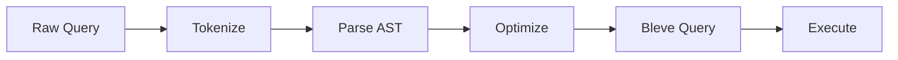
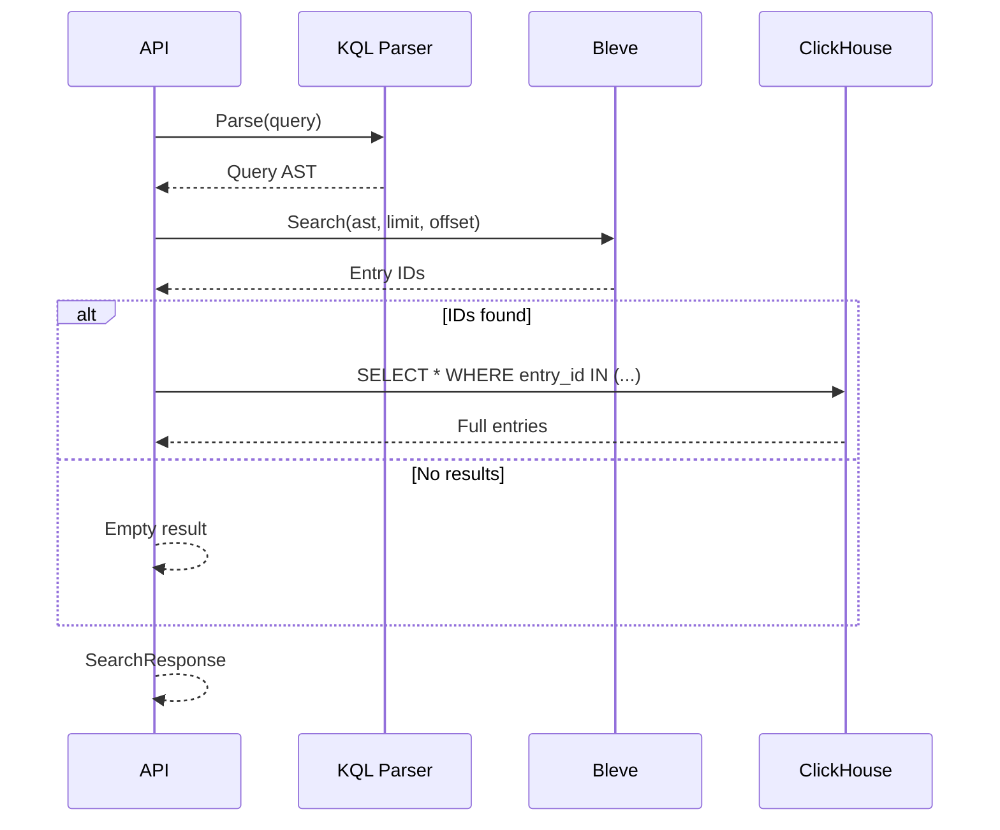

# Search Service

This document describes the search service internals.

## Components

### KQL Parser

**File:** `backend/internal/search/kql.go`

Parses KQL (Kibana Query Language) queries.

```go
type KQLParser struct{}

func (p *KQLParser) Parse(query string) (*Query, error)
```

### Bleve Index

**File:** `backend/internal/search/bleve.go`

Manages full-text search indexes.

```go
type BleveIndex struct {
    index bleve.Index
    path  string
}

func (b *BleveIndex) Index(entry domain.LogEntry) error
func (b *BleveIndex) Search(query *Query, limit, offset int) (*SearchResult, error)
```

## KQL Syntax

### Field Queries

```
user:admin
form:"HPD:Help Desk"
type:API
```

### Range Queries

```
duration_ms > 1000
duration_ms >= 500
duration_ms < 10000
```

### Boolean Operators

```
user:admin AND type:API
type:SQL OR type:API
NOT success:false
```

### Wildcards

```
form:*Help*
user:admin*
```

### Combined Queries

```
type:API AND duration_ms > 1000 AND user:admin
```

## Query Parsing



## Index Schema

```go
type LogEntryDocument struct {
    EntryID     string    `json:"entry_id"`
    LineNumber  uint32    `json:"line_number"`
    Timestamp   time.Time `json:"timestamp"`
    LogType     string    `json:"log_type"`
    TraceID     string    `json:"trace_id"`
    User        string    `json:"user"`
    Form        string    `json:"form"`
    Operation   string    `json:"operation"`
    DurationMS  uint32    `json:"duration_ms"`
    Success     bool      `json:"success"`
    RawText     string    `json:"raw_text"`
}
```

## Index Mapping

```go
indexMapping := bleve.NewIndexMapping()

logEntryMapping := bleve.NewDocumentMapping()

// Exact match fields
logEntryMapping.AddFieldMappingsAt("user", keywordFieldMapping)
logEntryMapping.AddFieldMappingsAt("form", keywordFieldMapping)
logEntryMapping.AddFieldMappingsAt("trace_id", keywordFieldMapping)

// Full-text fields
logEntryMapping.AddFieldMappingsAt("raw_text", textFieldMapping)

// Numeric fields
logEntryMapping.AddFieldMappingsAt("duration_ms", numericFieldMapping)

indexMapping.AddDocumentMapping("LogEntry", logEntryMapping)
```

## Search Flow



## Performance

| Operation | Time |
|-----------|------|
| Index single entry | ~0.1ms |
| Search (1000 results) | ~50ms |
| Wildcard search | ~100ms |

## Configuration

| Variable | Default | Description |
|----------|---------|-------------|
| BLEVE_INDEX_PATH | /data/index | Index storage path |
| SEARCH_BATCH_SIZE | 5000 | Batch size for indexing |
