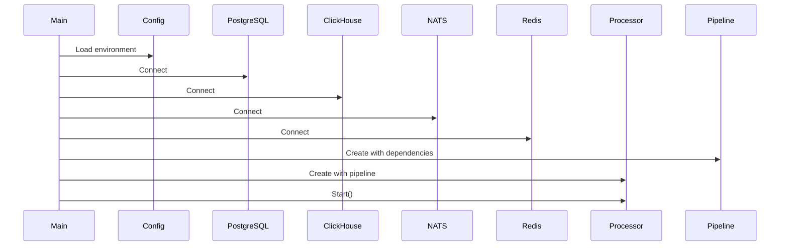
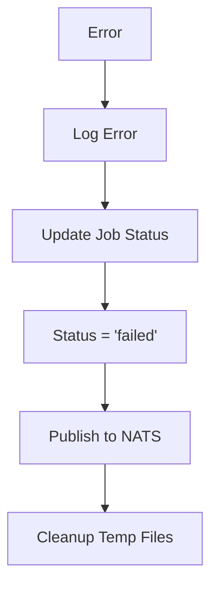

# Worker Service

This document describes the worker service internals.

## Entry Point

**File:** `backend/cmd/worker/main.go`

## Startup Sequence



## Components

### Processor

**File:** `backend/internal/worker/processor.go`

Subscribes to NATS and dispatches jobs to the pipeline.

```go
type Processor struct {
    pipeline *Pipeline
    nats     streaming.NATSStreamer
    tenantID string
}

func (p *Processor) Start(ctx context.Context) error {
    return p.nats.SubscribeJobSubmit(ctx, p.tenantID, func(job domain.AnalysisJob) {
        p.pipeline.ProcessJob(ctx, job)
    })
}
```

### Pipeline

**File:** `backend/internal/worker/ingestion.go`

Orchestrates the job processing stages.

```go
type Pipeline struct {
    pg      storage.PostgresStore
    ch      storage.ClickHouseStore
    s3      storage.S3Storage
    redis   storage.RedisCache
    nats    streaming.NATSStreamer
    jar     JARRunner
    anomaly *AnomalyDetector
}
```

### Anomaly Detector

**File:** `backend/internal/worker/anomaly.go`

Detects statistical anomalies in log data.

```go
type AnomalyDetector struct {
    threshold float64 // Z-score threshold
}

func (d *AnomalyDetector) Detect(ctx context.Context, jobID, tenantID, anomalyType, metric string, points []DataPoint) []Anomaly {
    // Calculate mean and stddev
    // Find outliers beyond threshold
    // Return detected anomalies
}
```

### Indexer

**File:** `backend/internal/worker/indexer.go`

Builds Bleve search indexes.

```go
type Indexer struct {
    indexPath string
}

func (i *Indexer) Index(entries []domain.LogEntry) error {
    // Open or create index
    // Batch index entries
    // Return on completion
}
```

## Job Processing Stages

| Stage | Progress | Actions |
|-------|----------|---------|
| Download | 0-15% | Download from S3 to temp file |
| JAR | 15-70% | Execute ARLogAnalyzer.jar |
| Parse | 70-75% | Parse JSON output |
| Cache | 75-85% | Store dashboard in Redis |
| Store | 85-95% | Insert entries to ClickHouse |
| Index | 95-99% | Build Bleve index |
| Complete | 100% | Update job status |

## Error Handling



## Configuration

| Variable | Default | Description |
|----------|---------|-------------|
| JVM_HEAP_MB | 4096 | JAR heap size |
| JOB_TIMEOUT | 30m | Job timeout |
| BLEVE_INDEX_PATH | /data/index | Index storage |

## Scaling

Currently single-replica due to Bleve index:

```
Worker (1 replica) → PVC (ReadWriteOnce) → Bleve Index
```

Future scaling options:
1. Replace Bleve with Elasticsearch
2. Implement index sharding
3. Use distributed lock
